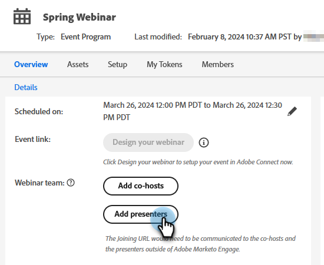

# Agregar un equipo del seminario web {#add-a-webinar-team}

Un equipo de seminarios web en seminarios web interactivos consta de todas las funciones que contribuyen al éxito de la entrega del seminario web en Adobe Connect. Esto incluye a presentadores y coanfitriones.

>[!IMPORTANT]
>
>Se recomienda encarecidamente que [diseñe su seminario web](/help/marketo/product-docs/demand-generation/events/interactive-webinars/designing-interactive-webinars.md){target="_blank"} _antes de_ que agregue presentadores o co-anfitriones.

>[!NOTE]
>
>Los presentadores y co-presentadores de Marketo Engage se asignan exactamente a las funciones de presentador y anfitrión durante la entrega del seminario web en Adobe Connect. Los hosts simultáneos pueden modificar los diseños y los pods, mientras que los presentadores no pueden.

El presentador es una función externa que participa en la entrega de la experiencia del seminario web, mientras que los coanfitriones pueden actuar como presentadores y gestionar los aspectos administrativos de la entrega del seminario web. Los hosts compartidos pueden ser tanto internos como externos. Los co-hosts externos no tendrán acceso a los programas de eventos de seminario web interactivo en Marketo, pero tendrán permisos de host durante el envío en Adobe Connect. Los co-hosts internos tendrán acceso al programa de eventos de seminarios web interactivos en Marketo, así como permisos de host durante la entrega. Esto ayuda a garantizar que los co-anfitriones internos puedan tomar las riendas del programa de evento de seminario web interactivo cuando el creador original del programa de seminario web interactivo ya no forme parte del conjunto de usuarios de los seminarios web interactivos o incluso cuando no sea un usuario de Marketo.

>[!PREREQUISITES]
>
>* [Crear un seminario web interactivo](/help/marketo/product-docs/demand-generation/events/interactive-webinars/create-an-interactive-webinar.md){target="_blank"}
>
>* [Diseñe su seminario web interactivo](/help/marketo/product-docs/demand-generation/events/interactive-webinars/designing-interactive-webinars.md){target="_blank"}

## Añadir un host compartido {#add-a-co-host}

1. En la página Información general del seminario web interactivo, haga clic en **Agregar co-hosts**.

   

1. Puede añadir usuarios internos o externos. En este ejemplo, elegimos externo.

   

   >[!NOTE]
   >
   >Si selecciona **Usuario interno del seminario web interactivo**, solo tendrá que hacer clic en el menú desplegable **Hosts disponibles** y elegir de la lista de personas que se han agregado como usuarios de seminarios web interactivos en Marketo Engage. Los hosts existentes no se verán a sí mismos en esta lista desplegable, ya que ya son hosts.

1. Introduzca el nombre, los apellidos y la dirección de correo electrónico del cohost deseado. Haga clic en **Agregar**.

   

1. El nuevo coanfitrión aparecerá en la sección Equipo del seminario web.

   

## Agregar un moderador {#add-a-presenter}

1. En la página Información general del seminario web interactivo, haga clic en **Agregar moderadores**.

   

1. Escriba el nombre, apellidos y dirección de correo electrónico del moderador deseado. Haga clic en **Agregar**.

   

   >[!NOTE]
   >
   >La información del moderador se pondrá a disposición de Adobe Connect durante la entrega del seminario web, de modo que los detalles correspondientes se puedan rellenar automáticamente sin que el usuario tenga que introducirlos durante la entrada para la entrega del seminario web.

1. El nuevo moderador aparecerá en la sección Equipo del seminario web.

   

>[!TIP]
>
>Después de agregar un equipo de seminario web, puede hacer clic en el icono Copiar situado junto a cada usuario para copiar (y luego compartir) las URL de unión.

>[!MORELIKETHIS]
>
>[Crear un seminario web interactivo](/help/marketo/product-docs/demand-generation/events/interactive-webinars/create-an-interactive-webinar.md){target="_blank"}
