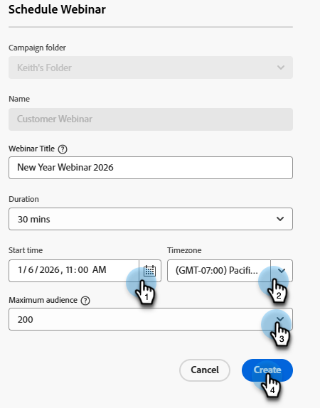

# Crear un seminario web interactivo {#create-an-interactive-webinar}

Cree un seminario web interactivo en unos sencillos pasos.

1. Vaya a **Actividades de marketing**.

   

1. Haga clic con el botón derecho en la carpeta deseada y seleccione **Nuevo programa**.

   

   >[!CAUTION]
   >
   >[Los recursos de ](/help/marketo/product-docs/mobile-marketing/push-notifications/understanding-push-notifications.md){target="_blank"}notificación push móvil **no son compatibles con los seminarios web interactivos.**

1. Asigne un nombre al programa. En Tipo de programa, seleccione **Evento**.

   

1. Haga clic en el menú desplegable Canal y seleccione cualquier canal que tenga _Evento con seminario web_ en la columna &quot;Se aplica a&quot;. En este ejemplo, elegimos **Seminario web**.

   

   >[!NOTE]
   >
   >Para ver qué canales se aplican al _evento con el seminario web_, ve a **Administrador** > **Etiquetas**. &quot;Se aplica a&quot; debe ser la columna central. Obtenga más información sobre &quot;Se aplica a&quot; en el paso 5 de [este artículo](/help/marketo/product-docs/administration/tags/create-a-program-channel.md){target="_blank"}.

1. Elija **seminarios web interactivos** y haga clic en **Siguiente**.

   

1. Asigne un título al seminario web y decida cuánto durará.

   

   >[!NOTE]
   >
   >* El título del seminario web **es** visible para los participantes cuando se unen. Es importante que el título sea diferente del nombre del programa de eventos de seminarios web interactivos de la instancia de Marketo Engage, así como del nombre de la sala de seminarios web.
   >
   >* No puede reutilizar un título de seminario web. Cada uno debe ser único en la instancia de Marketo.
   >
   >* Si lo desea, puede cambiar el título del seminario web en una etapa posterior.
   >
   >* Si crea un seminario web de prueba, debe eliminarse antes de su hora de inicio para garantizar que la licencia de ese seminario web no se utilice.

1. Programe la fecha y la hora del seminario web, cambie la zona horaria (si lo desea) y establezca el tamaño máximo de audiencia. Haga clic en **Crear** cuando haya terminado.

   

>[!NOTE]
>
>Se recomienda espaciar dos eventos consecutivos por 30 minutos (a menos que la licencia admita seminarios web simultáneos) como búfer en caso de que el seminario web anterior se ejecute más allá de su hora programada.

Es hora de [diseñar tu seminario web](/help/marketo/product-docs/demand-generation/events/interactive-webinars/designing-interactive-webinars.md){target="_blank"}.
