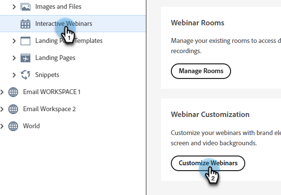

# Personalización de seminarios web interactivos {#interactive-webinars-customization}

La personalización de los seminarios web es crucial para crear una experiencia más atractiva y eficaz para los participantes.

Los seminarios web interactivos ofrecen varias opciones de personalización para adaptar el entorno del seminario web a sus necesidades. Personalice el aspecto de diferentes pantallas para reflejar la marca de su organización.

Puede personalizar las siguientes opciones:

* Colores de marca para la habitación
* Fondo personalizado para representar a su organización en las pantallas de entrada, salida y espera
* Logotipo
* Fondos de vídeo virtual

## Conceder permisos {#grant-permissions}

Antes de que cualquier usuario de su organización pueda personalizar sus seminarios web interactivos, un administrador de Marketo Engage debe añadir acceso a las funciones deseadas.

1. En Marketo Engage, haga clic en **[!UICONTROL Administrador]**.

   

1. Haga clic en **[!UICONTROL Usuarios y roles]** y, a continuación, en la ficha **[!UICONTROL Roles]**.

   

1. Haga doble clic en la función a la que desee agregar los permisos.

   

1. Haga clic para abrir **[!UICONTROL Access Design Studio]**.

   

1. Seleccione la casilla de verificación **[!UICONTROL Acceder a la personalización de seminarios web interactivos]**.

   

## Personalizar pantallas interactivas de seminarios web {#customize-interactive-webinar-screens}

1. Vaya a **Design Studio**.

   

1. Haga clic en **seminarios web interactivos** y seleccione **Personalizar seminarios web**.

   

1. Puede personalizar la interfaz de la sala, las pantallas inmediatas o los fondos de vídeo virtual.

   

## Personalización de la interfaz de sala {#customize-the-room-interface}

Puede personalizar el aspecto de la sala de sesiones cambiando el logotipo, el vínculo de redirección en el que se puede hacer clic y los colores. Los cambios se reflejarán en todos los eventos y salas de su organización.

Para personalizar el aspecto de una sala, seleccione la ficha Interfaz de sala en la barra de menús.

1. En el panel derecho, personalice las siguientes preferencias:

   

   **Logotipo personalizado**: selecciona Cargar logotipo y explora la imagen desde tu dispositivo. El tamaño de la imagen no debe superar los 50 x 31 píxeles y puede estar en diferentes formatos de archivo: .svg, .gif, .jpg y .png. Puede cambiar o eliminar su logotipo.

   **Vínculo de redirección**: Agregue una dirección URL para redirigir a los asistentes después de que hagan clic en el logotipo.

   **Texto alternativo**: agregue un texto alternativo para los asistentes mediante las características de accesibilidad.

   **Colores**: selecciona colores para la barra de la sala, los iconos de la sala, el fondo de la sala, la barra del pod y los iconos o mosaicos del pod para cambiar el color de las diferentes secciones.

   También puede introducir el código de color HEX mediante la opción HEX.

   Seleccione **[!UICONTROL Ver plantillas]** para cambiar el tema de la sala.

   Después de realizar los cambios, puede comprobar el logotipo y los colores en Vista previa.

1. Seleccione **[!UICONTROL Aplicar]** para guardar los cambios. Para restablecer la configuración predeterminada, haga clic en **[!UICONTROL Restablecer a la configuración predeterminada]**.

   

### Personalización de pantallas intermedias {#customize-intermediate-screens}

Cambie la imagen de fondo para cambiar el aspecto de las pantallas de entrada, salida y espera. Los cambios se reflejan en todos los eventos y salas de su organización.

Para personalizar el aspecto de una sala, seleccione la ficha Pantallas intermedias en la barra de menús.

1. En el panel derecho, personalice la imagen de fondo seleccionando **Cargar imagen** y busque un logotipo en una imagen. El tamaño de la imagen no debe superar los 1920 x 1080 píxeles y puede estar en diferentes formatos de archivo: .svg, .gif, .jpg y .png. Si lo desea, puede cambiar o eliminar el logotipo.

   

   >[!NOTE]
   >
   >La imagen cargada se aplica en las pantallas de entrada, salida y espera.

1. Seleccione **[!UICONTROL Aplicar]** para guardar los cambios. Para restablecer la configuración predeterminada, haga clic en **[!UICONTROL Restablecer a la configuración predeterminada]**.

### Personalizar fondos de vídeo virtuales {#Customize-virtual-video-backgrounds}

Utilice fondos definidos por la organización durante los eventos para mostrar el logotipo o la imagen de marca de la organización en el fondo de la fuente de vídeo de la cámara. Para añadir los fondos virtuales de su organización, seleccione la pestaña Fondos de vídeo virtuales en la barra de menús. Puede optar por mostrar solo fondos personalizados, fondos de Adobe Connect o ambos.

**Fondos personalizados**

1. Haga clic en el conmutador a fin de permitir fondos personalizados en los eventos y salas.

   

1. Seleccione **Cargar fondo** para cargar un fondo personalizado. El tamaño de la imagen no debe superar los 1920 x 1080 píxeles y puede estar en diferentes formatos de archivo: .svg, .gif, .jpg y .png.

Pase el ratón sobre la imagen de fondo personalizada para eliminarla de los fondos de vídeo.

Después de realizar los cambios, vea el fondo en Vista previa.

Puede utilizar el control deslizante de la pantalla Vista previa para acercar o alejar el contenido y probar el aspecto que tendría el fondo virtual si el usuario estuviera cerca o lejos de la cámara. Si hay texto en segundo plano, esto ayudaría a garantizar que permanezca visible.

1. Seleccione **[!UICONTROL Aplicar]** para guardar los cambios. Para restablecer la configuración predeterminada, haga clic en **[!UICONTROL Restablecer a la configuración predeterminada]**.

**Fondos de Adobe Connect**

Adobe Connect proporciona nueve fondos predeterminados listos para usar. Puede ver su aspecto en Vista previa.

Utilice el conmutador para controlar la disponibilidad de estos fondos predeterminados en sus eventos y salas.

Seleccione **Aplicar** para guardar los cambios o **Restablecer a los valores predeterminados** para restablecer los valores predeterminados.

### Crear temas personalizables {#create-customizable-themes}

* Los administradores pueden crear o administrar temáticas con logotipos, colores y fondos de vídeo personalizados.

* Los anfitriones pueden elegir temas durante la creación de la sala o actualizarlos más tarde desde la página de información de la sala (**Barra superior de la sala** > **Menú más** > **Ver información de la sala**).

Más información sobre [Temas](https://helpx.adobe.com/adobe-connect/connect-central-admin/connect-central-ui-customization-basics.html){target="_blank"}.
