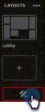

# Ofrecer un seminario web interactivo {#deliver-an-interactive-webinar}

El seminario web interactivo está listo para comenzar. Aprenda todo lo que necesita saber sobre cómo presentarlo.

1. Seleccione el evento y haga clic en **Participe en el seminario web**.

   

   >[!NOTE]
   >
   >Se recomienda hacerlo al menos 15 minutos antes de la hora de inicio programada.

1. Si es un presentador o un copatrocinador, haga clic en el vínculo personalizado del correo electrónico que recibió para el seminario web.

1. Seleccione sus preferencias de audio/vídeo y haga clic en **Introducir sala**.

   

1. Seleccione el diseño que se mostrará a los primeros participantes.

   

   >[!NOTE]
   >
   >Los participantes pueden entrar a la sala hasta 15 minutos antes del inicio programado y verán el diseño activo. Se recomienda diseñar un diseño &quot;Lobby&quot; para ellos.

   >[!TIP]
   >
   >Active Controles de difusión para entrar en una sala verde virtual. Esto permite a los presentadores y presentadores hablar en privado y verse entre sí sin que el audio y el vídeo se transmitan a los participantes en la sala. Es ideal antes y después de la sesión, donde puede probar el audio y el vídeo, o informar después del seminario web.

1. Puede grabar la sesión si es necesario. Seleccione **Grabar sesión** en el menú de sala. La grabación puede detenerse más tarde desde el mismo menú.

   

1. La sesión comienza a la hora designada.

1. Haga clic en el nombre de la sala. En la lista desplegable, seleccione **Área de presentador y anfitrión** para chatear o compartir notas con el equipo de presentación entre bastidores. El área de presentador y host se abre en el lado derecho de la pantalla. Solo los hosts/cohosts y los moderadores pueden ver esta parte de la pantalla.

   

1. Cuando finalice la sesión, haga clic en el icono de flecha roja y seleccione **Finalizar sesión para todos**.

   

   >[!CAUTION]
   >
   >Si hace clic en Salir de la sala, sólo podrá salir de ella. **no** finalizará el seminario web.

   >[!TIP]
   >
   >Más información sobre [grabaciones y rendimiento del evento](/help/marketo/product-docs/demand-generation/events/interactive-webinars/event-workflows.md){target="_blank"}.

## Experiencia del participante {#participant-experience}

Los participantes pueden unirse al seminario web haciendo clic en el vínculo personalizado recibido después de registrarse en el evento.

1. Los participantes que inicien el vínculo del evento más de 15 minutos antes del inicio programado verán una página de aterrizaje que les informará de que deben esperar a que comience el evento.

   

1. Los participantes deben seleccionar sus preferencias de audio y luego hacer clic en Entrar en la sala. Los participantes que se unan a una sala de Adobe Connect por primera vez también verán una ventana emergente del explorador para obtener permiso de micrófono. Adobe Connect necesita este acceso para que los participantes puedan utilizar su micrófono más tarde dentro de la sala.

   

   >[!NOTE]
   >
   >La ventana emergente de permisos se puede cerrar sin proporcionar acceso. Los participantes deberán proporcionar acceso dentro de la sala si intentan activar su micrófono.

## Configuración y áreas {#settings-and-areas}

### Área de anfitrión y presentador {#host-and-presenter-area}

El área &quot;Anfitrión y presentador&quot; (también conocida como &quot;Backstage&quot;) es un área privada que se encuentra en el lado derecho de una sala de reuniones que solo los anfitriones y presentadores pueden ver. Se puede utilizar para colaborar antes, durante y después de un evento. Utilice Chat, Notas y otros pods como canales secundarios dentro del área de Host y presentador.

Para acceder, selecciona **Área de presentador y anfitrión** en el menú desplegable de la sala. Obtenga más información sobre esta área en el [siguiente vídeo](https://www.youtube.com/watch?v=11GkcvIUttY){target="_blank"}.

### Controles de difusión {#broadcast-controls}

Broadcast Control añade una sala verde virtual a su sesión interactiva de seminarios web. Permite a los presentadores y presentadores hablar y verse en privado sin transmitir a los participantes en la sala. Es una excelente manera de probar el micrófono y la cámara web antes de una sesión. Los presentadores también pueden colaborar en el área de presentadores y anfitriones hasta que estén listos para publicar. Proporciona una forma para que el orador y los productores se informen entre sí en privado después de una sesión, en caso de que un asistente olvide abandonar el seminario web.

Los controles de difusión se pueden configurar para que comiencen a grabar automáticamente después de salir de la sala verde. Esto garantiza que los hosts no tengan que recordar iniciar y detener manualmente la grabación. Pausar o detener la emisión también pausará o detendrá la grabación. Todo es automático.

Obtenga más información acerca de los controles de difusión [en este vídeo](https://www.youtube.com/watch?v=TcoCeEJoyjg){target="_blank"}.

### Chats en grabaciones {#chats-in-recordings}

Según el caso de uso, podría ser una buena idea incluir o excluir el chat en la habitación dentro de las grabaciones del evento.

Las discusiones dentro de los pods de chat siempre se graban. Por lo tanto, si las conversaciones de chat añaden valor a los espectadores de grabación (los asistentes y los espectadores bajo demanda publican el evento en directo), utilice los pods de chat al diseñar la sala.

Las discusiones en el Panel de chat no se registran. El panel de chat también libera los bienes raíces que habrían sido ocupados por el pod de chat dentro del diseño. Por lo tanto, si las conversaciones de chat no van a añadir valor a los espectadores de grabación, utilice el Panel de chat en lugar de pods de chat al diseñar la sala.

Más información sobre [el panel de chat](https://helpx.adobe.com/es/adobe-connect/using/notes-chat-q-a-polls.html#chat_panel){target="_blank"}.

### Modo de preparación {#prepare-mode}

El modo de preparación permite a los anfitriones y presentadores crear o modificar un diseño de sala de reuniones entre bastidores mientras se lleva a cabo una sesión, pero sin que los participantes vean los cambios hasta que el anfitrión los haga visibles. La función Prepare Mode resalta los pods activos en azul y los pods no activos en blanco.

Para utilizar el modo de preparación:

1. Haga clic en el icono de la llave inglesa en la parte inferior del panel Diseños.

   

1. En el panel Diseños, elija el diseño que desea ajustar. Mover, ocultar o mostrar pods según sea necesario. También puede actualizar el contenido en pods, como cargar una nueva versión de la presentación en un pod compartido.

1. Cuando se realicen los cambios, elija **Finalizar modo de preparación** en el menú desplegable o haga clic en el icono de la llave inglesa por segunda vez.

Esto desactiva el modo de preparación y le devuelve al diseño activo.

Obtenga más información acerca del modo de preparación [en este vídeo](https://www.youtube.com/watch?v=kUya84sx-E4){target="_blank"}.

>[!NOTE]
>
>* Cualquier cambio realizado en los pods en directo se refleja instantáneamente en los participantes.
>* El [panel de chat](https://helpx.adobe.com/es/adobe-connect/using/notes-chat-q-a-polls.html#chat_panel){target="_blank"} no forma parte del modo de preparación y cualquier cambio que se realice en él se reflejará instantáneamente en los participantes.

### Accesibilidad {#accessibility}

El Adobe se esfuerza por incluir a presentadores y participantes con discapacidades mejorando la accesibilidad de los seminarios web interactivos. El software se mejora continuamente para satisfacer las necesidades de todos los tipos de usuarios y adherirse a los estándares mundiales que incluyen personas con deficiencias visuales, auditivas, de movilidad u otras.

Obtenga información sobre cómo Adobe Connect proporciona asistencia para [necesidades visuales, auditivas y de movilidad](https://helpx.adobe.com/es/adobe-connect/using/accessibility-features.html){target="_blank"}.

### Subtítulos opcionales {#closed-captions}

Los subtítulos opcionales son una representación textual del audio dentro de una sala de Adobe Connect y ayuda a los participantes sordos o con dificultades auditivas a participar en eventos. Puede integrar subtítulos en tiempo real del contenido de audio en eventos y presentarlos en la pantalla Subtítulos.

Aprenda a [habilitar subtítulos](https://helpx.adobe.com/es/adobe-connect/using/closed-captioning-html-client.html){target="_blank"}.
