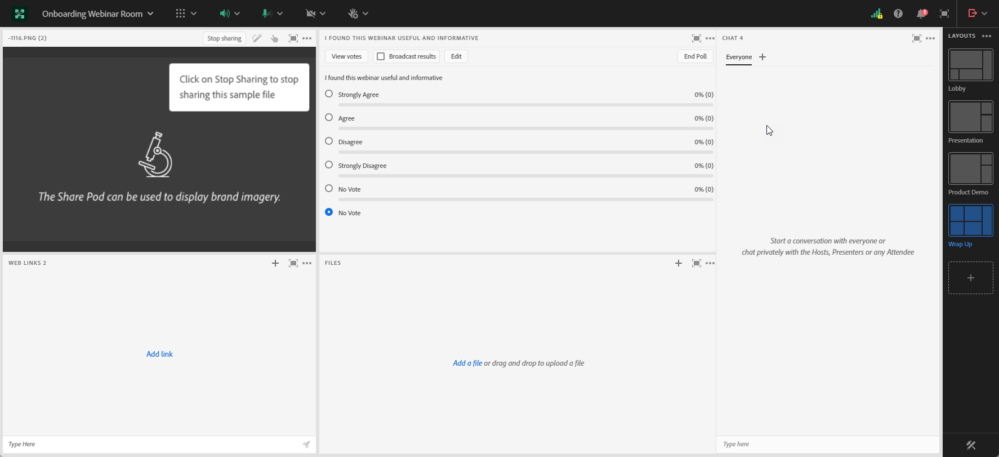

# Diseño de seminarios web interactivos {#designing-interactive-webinars}

Aprenda a diseñar un seminario web para adaptarlo a sus necesidades.

1. Seleccione su evento y haga clic en **Diseñar su seminario web**.

   

1. Puede elegir una sala de seminarios web existente o crear una nueva. En este ejemplo creamos uno nuevo, así que haga clic en la lista desplegable **Seleccionar sala** y elija **Nueva sala de seminarios web interactivos**.

   

   >[!NOTE]
   >
   >* Una sala es un espacio en línea que se utiliza para llevar a cabo reuniones.
   >
   >* Si elige una sala de seminarios web existente y necesita cambiarle el nombre, simplemente haga clic en el botón **Cambiar el nombre de la sala de seminarios web** que aparece a la derecha.
   >
   >* La lista desplegable solo muestra las salas existentes que creó anteriormente, no las de otros hosts.

1. Elija una plantilla.

   

1. Aparecerá la vista previa del seminario web.

   

   >[!NOTE]
   >
   >De forma predeterminada, el nombre de la sala indicada en el campo &quot;Nombre de la sala de seminarios web interactivos&quot; es el mismo nombre que el programa de eventos de seminarios web interactivos. Tiene la opción de cambiarlo para reflejar el título del propio seminario web, ya que este nombre es visible para la audiencia.

   >[!TIP]
   >
   >El seminario web se establecerá en el idioma predeterminado en la instancia de Marketo Engage, pero tiene la opción de cambiar los idiomas por seminario web mediante la lista desplegable situada encima de la vista previa.

1. Puede seleccionar diferentes diseños para previsualizarlos. Para continuar, haga clic en **Usar plantilla**.

   

1. Puede perfeccionar el seminario web de inmediato o más tarde. Vamos a hacerlo ahora. Haga Clic **Refine Your Webinar Now**.

   

1. Seleccione sus preferencias de audio/vídeo y haga clic en **Introducir sala**.

   

1. La plantilla seleccionada ahora se puede editar.

   

1. Para obtener información detallada sobre las salas y las plantillas, consulte la sección &quot;Plantillas y diseños de sala de reuniones&quot; de [este artículo de ayuda de Adobe](https://helpx.adobe.com/in/adobe-connect/using/creating-arranging-meetings.html#creating_and_arranging_meetings){target="_blank"}.

1. Cuando termine de diseñar el seminario web, haga clic en **Salir de la sala**.

   

## Elementos de diseño {#design-elements}

**Plantilla**: la estructura proporcionada a una sala se basa en el objetivo del seminario web que se está enviando. Por ejemplo, si desea programar un seminario web de presentación de productos, el uso compartido de la pantalla sería un componente esencial para mostrar la demostración. La plantilla garantiza que los componentes esenciales necesarios para una entrega eficaz de un tipo concreto de seminario web estén implementados durante la configuración de la sala de seminario web.

**Diseño**: Hace referencia a varias formas en que los diversos componentes necesarios para garantizar el éxito del seminario web se organizan en una plantilla determinada. Una sola plantilla puede tener varios diseños para que pueda elegir. Los componentes esenciales del seminario web seguirían siendo los mismos en todas las plantillas. La disposición que seleccionó se adaptaría mejor al estilo o las necesidades de usted o del presentador que imparte el seminario web.

**Pod**: Un componente dentro de una plantilla que realiza una actividad en particular durante el seminario web. Por ejemplo, configurar y enviar una encuesta para capturar las respuestas de los participantes en una actividad que un pod de encuestas puede cumplir. Del mismo modo, charlar con los participantes para transmitir un mensaje o interactuar casualmente con ellos puede ser una actividad que se ofrece a través del pod de chat. Hay varios pods más disponibles, como Compartir, Notas, Vídeo, Chat, Lista de asistentes, Archivos, Vínculos web, Encuestas y Preguntas y respuestas.
