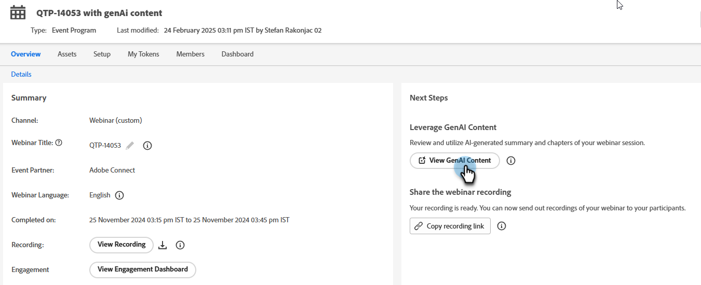
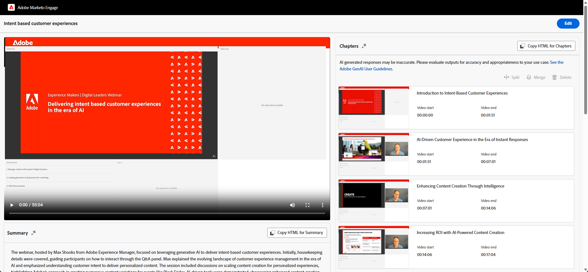
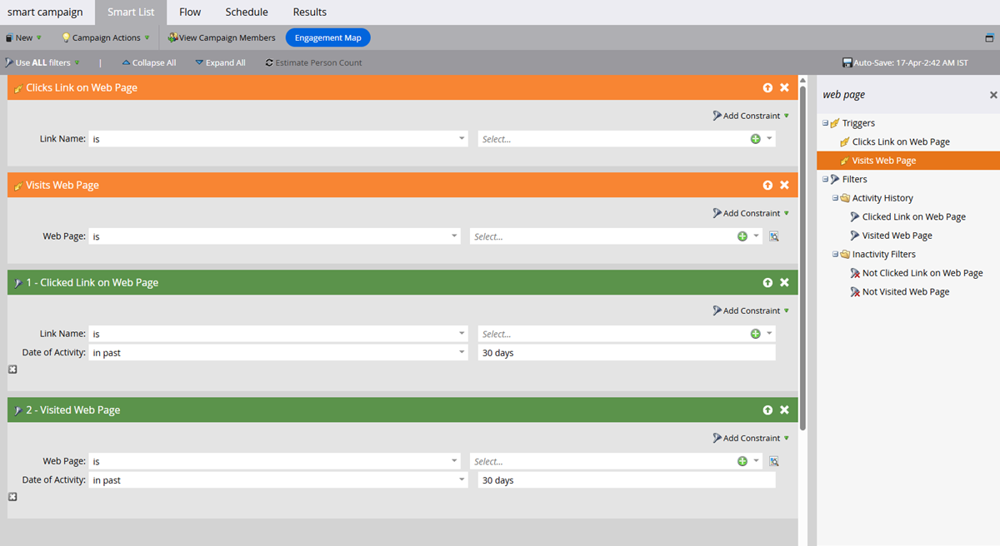

# Funciones de GenAI {#gen-ai-features}

Genere automáticamente capítulos y resúmenes para sus seminarios web grabados, lo que los hace más accesibles y fáciles de navegar para su audiencia.

* **Generación automática de capítulos**: La tecnología con tecnología de IA crea capítulos para el contenido del seminario web.

* **Resumen generado por IA**: obtenga un resumen de texto automatizado de su seminario web.

* **Contenido editable**: modifique los capítulos y resúmenes generados si lo desea, mediante funciones de edición manuales y con tecnología de IA.

* **Fácil integración**: Agregue fácilmente capítulos y resúmenes a sus páginas de aterrizaje copiando el código HTML en el editor de páginas web que elija.

## Habilitar GenAI {#enable-genai}

>[!PREREQUISITES]
>
>Antes de utilizar estas funciones, primero debe aceptar los términos y condiciones de Adobe GenAI. Si todavía no lo ha hecho, póngase en contacto con el equipo de cuenta de Adobe (su administrador de cuentas) para obtener más información.

Después de aceptar los términos y condiciones de Adobe GenAI, el siguiente paso es habilitarlo para usuarios individuales. Para ello, vaya a **[!UICONTROL Administración]** > **[!UICONTROL Seminarios web interactivos]** y seleccione qué usuarios deben tener acceso a GenAI.

{width="800" zoomable="yes"}

## Cómo acceder a {#how-to-access}

1. Vaya a la página de información general del seminario web en los seminarios web interactivos de Marketo Engage.

1. Después de llevar a cabo el seminario web bajo demanda, espere de 30 a 60 minutos para que la IA procese la grabación. Se puede hacer clic en el botón Generar cuando esté disponible.

1. Haga clic en **[!UICONTROL Ver contenido de GenAI]**.

   {width="800" zoomable="yes"}

1. Se abre una nueva pestaña que muestra capítulos generados por IA y un resumen de texto.

## Editar contenido generado {#edit-generated-content}

1. Revise los capítulos y el resumen generados.

1. Si es necesario realizar cambios, haga clic en el botón **[!UICONTROL Editar]**.

   Realizar modificaciones:

   * Edite el texto del resumen o de los títulos de los capítulos.

   * Ajuste las marcas de tiempo si es necesario editando los valores de los campos con marcas de tiempo.

   * Elimine los capítulos no deseados seleccionándolos y haciendo clic en **[!UICONTROL Eliminar]**.

   * Combine dos capítulos consecutivos seleccionándolos y haciendo clic en **[!UICONTROL Combinar]**.

      * AI genera un capítulo compuesto formado por los dos capítulos seleccionados

      * Para combinar varios capítulos, debe hacer dos a la vez

     {width="800" zoomable="yes"}

   >[!NOTE]
   >
   >* Si lo desea, puede clasificar la calidad de los capítulos o del resumen generados con los iconos _miniaturas arriba_  o _miniaturas abajo_ . También puede marcar cualquier contenido problemático si hace clic en el icono de marca .
   >
   >* Si no está satisfecho con el resumen inicial, puede hacer clic en el botón **[!UICONTROL Volver a generar resumen]** y se generará otra versión.

1. Guarde los cambios haciendo clic en el botón **[!UICONTROL Guardar]** en la parte superior derecha de la pantalla.

## Usar contenido generado {#use-generated-content}

Después de copiar el contenido que desea utilizar, péguelo en el editor que prefiera (por ejemplo, el editor de páginas de aterrizaje de Marketo Engage) y realice los ajustes que desee.

### Resumen {#summary}

**Copiar HTML**: haga clic en el botón **[!UICONTROL Copiar HTML]** para obtener todo el texto, y aplique formato a todo el código HTML dentro de una tabla.

**Solo texto**: si desea solo texto, resáltelo y seleccione Ctrl/Cmd+C (o haga clic con el botón secundario) para copiar.

### Capítulos {#chapters}

**Copiar HTML**: haz clic en el botón **[!UICONTROL Copiar HTML]** para obtener toda la grabación y sus capítulos formateados dentro de un reproductor de vídeo.

## Dirigirse a su audiencia

Aproveche los déclencheur o los filtros de campañas o listas inteligentes para ver qué vio cada espectador, cuántas veces, etc., lo que permite realizar seguimientos personalizados.

{width="800" zoomable="yes"}

* **Déclencheur**: _Hace clic en el vínculo de la página web_, _Visita la página web_

* **Filtros**: _Se hizo clic en el vínculo de la página web_, _Se visitó la página web_

El &quot;vínculo&quot; es el nombre del capítulo y la &quot;página web&quot; es la página que aloja el seminario web bajo demanda.

>[!TIP]
>
>Use [restricciones](/help/marketo/product-docs/core-marketo-concepts/smart-lists-and-static-lists/using-smart-lists/add-a-constraint-to-a-smart-list-filter.md){target="_blank"} para restringir aún más la audiencia de destino.

## Cosas que debe tener en cuenta {#things-to-note}

* La eliminación o combinación de capítulos solo afecta a la pila de capítulos, no al propio contenido del vídeo. Estas acciones son permanentes.

* Las funciones de GenAI son flexibles y se pueden utilizar con varios editores de páginas web, no solo con los de Marketo Engage.

* Obtenga siempre una vista previa de los cambios para garantizar la funcionalidad y el aspecto deseados.

* Al eliminar el seminario web, también se elimina el contenido de GenAI.

* Si desea eliminar el contenido de GenAI sin eliminar el seminario web, póngase en contacto con el equipo de cuenta de Adobe (su administrador de cuentas) o envíe una solicitud de eliminación de datos a: `marketo-webinar-genai-alerts@adobe.com`.
