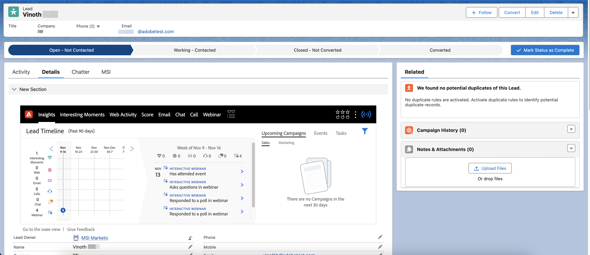

# Seminarios web interactivos en Marketo Sales Insight {#interactive-webinars-in-marketo-sales-insight}

Los seminarios web interactivos de Marketo Sales Insight permiten que las actividades de sus seminarios web estén disponibles en el complemento de Marketo Sales Insight (MSI) de Salesforce.

>[!PREREQUISITES]
>
>Esta característica solo es compatible con aquellos que hayan comprado el complemento [Marketo Sales Insight](https://business.adobe.com/products/marketo/sales-intelligence-engagement.html).

Una vez que las actividades se registran en Marketo Engage (después de completar el seminario web en Adobe Connect), se sincronizan en tiempo real con Salesforce mediante el complemento MSI.

Todas las actividades que están disponibles en Marketo Engage se sincronizan. Estas actividades son:

* Asiste a un evento
* Responde a una encuesta
* Responde a una pregunta
* Hace clic en un vínculo
* Descarga un recurso

Todos los atributos relevantes de estas actividades también se ponen a disposición del vendedor para que revise y tome medidas sobre los posibles clientes individuales. La información de la actividad está disponible en la sección genérica de perspectivas, así como en una pestaña de seminario web independiente.

En la sección Perspectivas, el gráfico Cronología del posible cliente contiene otra pista de natación para seminarios web que resaltan las actividades sincronizadas de los últimos 90 días para cada semana. Al seleccionar una semana en particular, las actividades se muestran por día en una sección independiente. Puede expandir actividades individuales para ver sus detalles.

{width="800" zoomable="yes"}

En la pestaña Seminario web independiente, todas las actividades (y sus fechas) se muestran también en formato de tabla.

{width="800" zoomable="yes"}
