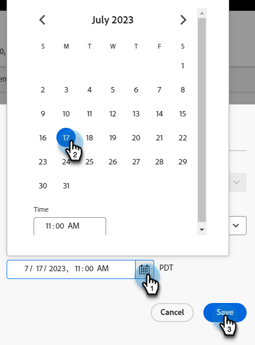

# Modificar o eliminar un seminario web interactivo {#modify-or-delete-an-interactive-webinar}

Obtenga información sobre cómo realizar cambios en el seminario web interactivo.

## Modificar un seminario web interactivo {#modify-an-interactive-webinar}

1. Seleccione el programa de eventos deseado y haga clic en **Cambiar sala/plantilla**.

   

1. Texto

PICC

?? para Nilesh - ¿es normal no ser llevado a la sala en la que el Seminario web ya está? Si no es así, ¿cuál es la mejor práctica?

## Reprogramar un seminario web interactivo {#reschedule-an-interactive-webinar}

1. Seleccione el programa de eventos deseado y haga clic en el icono de lápiz situado junto a la fecha y hora programadas actualmente.

   

1. Haga clic en el icono de calendario, seleccione la nueva fecha y hora y haga clic en **Guardar**.

   

## Clonar un seminario web interactivo {#clone-an-interactive-webinar}

1. Seleccione el programa de eventos que desee.

   

1. Haga clic en la lista desplegable Acciones de programa y seleccione **Clonar**.

   

   >[!TIP]
   >
   >También puede hacer clic con el botón derecho en el Programa de eventos del árbol y seleccionar **Clonar** desde allí.

1. Asigne un nombre al programa clonado, establezca el espacio de trabajo y el destino (si desea que el programa viva en otro lugar) y haga clic en **Guardar**.

   

1. Haga clic en **Siguiente**.

   

1. Elija la configuración del seminario web clonado y haga clic en **Clonar**.

   

## Eliminar un seminario web interactivo {#delete-an-interactive-webinar}

1. Seleccione el programa de eventos que desee.

   

1. Haga clic en la lista desplegable Acciones de programa y seleccione **Eliminar**.

   

   >[!TIP]
   >
   >También puede hacer clic con el botón derecho en el Programa de eventos del árbol y seleccionar **Eliminar** desde allí.

1. Haga clic en **Eliminar**.

   

   >[!IMPORTANT]
   >
   >Si hay algún recurso local en el programa, también se eliminará.
