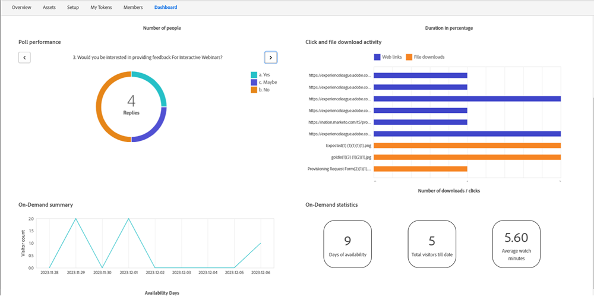

# Seminarios web bajo demanda {#on-demand-webinars}

Los seminarios web a petición capturan y perfeccionan los posibles clientes que se registraron en el evento y no asistieron, pero que desean obtener información relacionada con el evento observando la grabación. La información como el nombre, el ID de correo electrónico y la fecha y duración del seguimiento se puede recopilar en Marketo Engage y utilizar para dirigirse a estos posibles clientes que no acuden.

La URL de unión al seminario web que se compartió con los inscritos antes del evento se puede utilizar para ver la grabación bajo demanda. Una vez que un usuario registrado que no asistió al evento en directo (por ejemplo, un posible cliente con un estado de programa como &quot;No presentarse&quot;), hace clic en la URL de unión al seminario web, el estado del programa de ese posible cliente cambia de &quot;No presentarse&quot; a &quot;Asistido bajo demanda&quot;. El estado del programa de los posibles clientes que vieron el evento en directo y tienen el estado &quot;Asistido&quot; no se vería afectado si deciden visitar la URL de unión y ver la grabación bajo demanda.

Adobe Connect, la tecnología que activa los seminarios web interactivos, realiza un seguimiento de la visita y de la duración del reloj correspondientes a los posibles clientes que ven la grabación, e informa de la información a Marketo Engage diariamente. El seguimiento de los seminarios web a petición se detiene 30 días después del evento. No se puede modificar la duración.

Marketo Engage proporciona las estadísticas de inspección para los seminarios web bajo demanda en la pestaña Tablero con la ayuda de los siguientes widgets:

* Resumen a petición: Proporciona un resumen del recuento de visitantes (no-espectadores) que ven la grabación después del evento en un día determinado

* Estadísticas a petición: Este widget proporciona información sobre:
   * Días en los que la grabación bajo demanda está disponible para su visualización: ayuda a los especialistas en marketing a realizar acciones como ejecutar campañas de correo electrónico cerca del final de la duración de disponibilidad de la grabación de 30 días.
   * Recuento total de visitantes para seminarios web a petición hasta la fecha: Recuento de todos los inscritos que no han comparecido y que han visto la grabación bajo demanda hasta la fecha.
   * Duración media del reloj en minutos para todos los visitantes: ofrece a los especialistas en marketing una idea de qué parte de la grabación se visualiza y qué campañas inteligentes se pueden utilizar para dirigirse a posibles clientes por encima de una duración de reloj determinada.

>[!NOTE]
>
>Las vistas solo se cuentan cuando la duración del reloj supera un minuto.

Los filtros y déclencheur de los seminarios web interactivos se han modificado para adaptarlos a los seminarios web bajo demanda. El déclencheur &quot;Asiste al evento&quot; y el filtro &quot;Ha asistido al evento&quot; se añaden con una restricción adicional (&quot;Modo de evento&quot;), en los que un experto en marketing puede elegir si el objetivo es una audiencia en directo o bajo demanda. Si la restricción &quot;Modo de evento&quot; no está seleccionada, las audiencias en directo y bajo demanda serán el objetivo. Otras restricciones, como &quot;Fecha de observación&quot; y &quot;Duración de la observación&quot;, se podrían utilizar con el modo de evento &quot;Bajo demanda&quot;. El filtro de inactividad &quot;No ha asistido a un evento&quot; también se puede utilizar para seminarios web bajo demanda con el modo de evento &quot;Bajo demanda&quot;.
