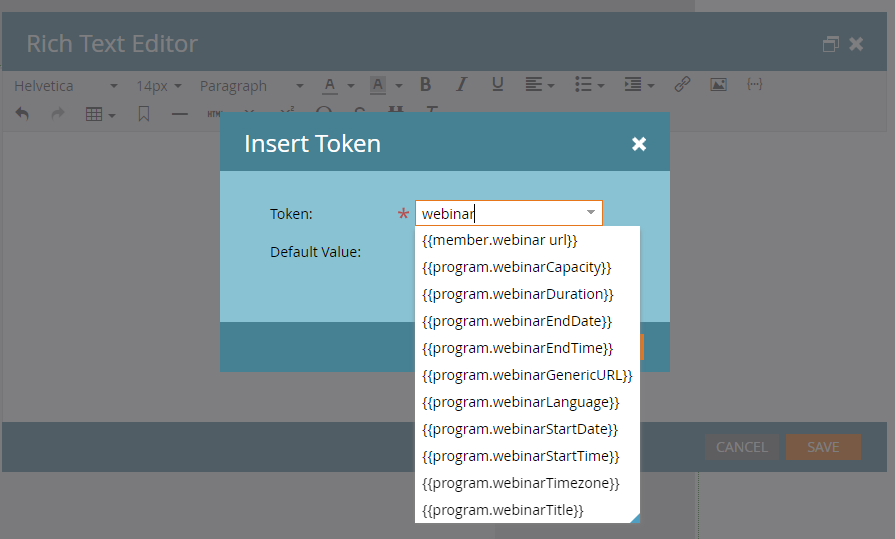

# Promoción de un seminario web interactivo {#promoting-an-interactive-webinar}

La promoción de un seminario web interactivo es similar a la de un seminario web de socio a través de LaunchPoint. Al crear un programa de eventos de seminario web interactivo, puede agregar miembros ejecutando una campaña o importando miembros al programa. Para comprobar los miembros que se han agregado al programa de eventos de seminarios web interactivos, haga clic en la ficha **Miembros**.

Una vez añadidos o importados los miembros, puede crear una campaña de correo electrónico dentro del programa de evento de seminario web interactivo para enviar una invitación a todos los miembros del programa y cambiar su estado a &quot;invitado&quot; una vez enviado el correo electrónico.

>[!NOTE]
>
>Si desea agregar un copatrocinador o presentador como miembro de la audiencia al programa de eventos de seminario web interactivo, debe utilizar un ID de correo electrónico diferente para ellos; de lo contrario, recibirán el error &quot;este correo electrónico ya está registrado&quot;.

El correo electrónico puede contener detalles específicos del programa, así como una dirección URL de la página de aterrizaje que redireccionaría al destinatario a una página específica donde se puede añadir más información sobre el seminario web (por ejemplo, contenido, información del presentador, etc.). Esta página de aterrizaje se puede crear como un recurso local en el programa de eventos de seminarios web interactivos.

Para solicitar el registro en este seminario web, habilite un formulario en la página de aterrizaje y vincule los clics del formulario para habilitar el registro en el programa de eventos del seminario web interactivo. A continuación, se puede crear una campaña que utilice los envíos de formularios como déclencheur y cambie el estado del programa de &quot;invitado&quot; a &quot;registrado&quot;.

>[!NOTE]
>
>La transición de &quot;invitado&quot; a &quot;registrado&quot; no es automática en los seminarios web interactivos, ya que puede haber varios déclencheur que la creen.

Una vez que un miembro ha estado en el estado de programa &quot;registrado&quot; en un programa de evento de seminario web interactivo, se registra automáticamente en el seminario web creado en Adobe Connect. A continuación, los datos de registro, como el nombre, los apellidos y el ID de correo electrónico, se transfieren a Adobe Connect. Esto significa que una vez que el usuario se una al seminario web como participante, la información estará disponible para el presentador o el anfitrión durante el seminario web.

A los pocos minutos de registrarse, la dirección URL del seminario web del miembro se rellenará en la pestaña Miembros. Si no puede localizar la columna de la URL del seminario web, asegúrese de que esa columna se haya agregado a la vista. Se trata de una dirección URL personalizada para que cada miembro registrado pueda entrar en el seminario web a la hora programada sin requerir ninguna autenticación. Los tokens intercambiados internamente se encargan de la autenticación de los miembros.

Puede utilizar tokens para incluir la URL del seminario web a los miembros individuales de una campaña de correo electrónico para comunicar que se han registrado en el evento y para utilizar la URL de unión para entrar en el seminario web a la hora programada. Los tokens de calendario se pueden usar en la misma campaña de correo electrónico para garantizar que la programación del seminario web se pueda agregar a los calendarios de los miembros.

Los vínculos están disponibles en la parte derecha de la pestaña Información general del programa de evento para crear una página de destino y una campaña de correo electrónico. El resto de las promociones relacionadas con un evento siguen siendo las mismas que los seminarios web de los socios que utilizan la integración de LaunchPoint.

Los seminarios web interactivos le permiten solicitar el registro antes, durante o después de un seminario web. En todos los casos, simplemente tendría que compartir la URL del seminario web con el posible cliente. Al hacer clic en el vínculo antes de que comience el seminario web, se envían a una página de aterrizaje previa al seminario web. Al hacer clic en él durante el seminario web, se les redirige al seminario web en curso. Al hacer clic en él después de que el seminario web los lleve a una grabación del seminario web.

## Tokens de seminarios web interactivos {#interactive-webinars-tokens}

Utilice tokens para promocionar seminarios web interactivos en correos electrónicos y páginas de destino sin tener que añadir manualmente los detalles del seminario web. Esto mejora la eficacia general, ya que cualquier cambio realizado en los metadatos del seminario web (como el título, la fecha de inicio, etc.) se reflejará automáticamente en los recursos.

**Lista de tokens**

* program.webinarCapacity
* program.webinarDuration
* program.webinarEndDate
* program.webinarEndTime
* program.webinarGenericURL
* program.webinarLanguage
* program.webinarStartDate
* program.webinarStartTime
* program.webinarTimezone
* program.webinarTitle
