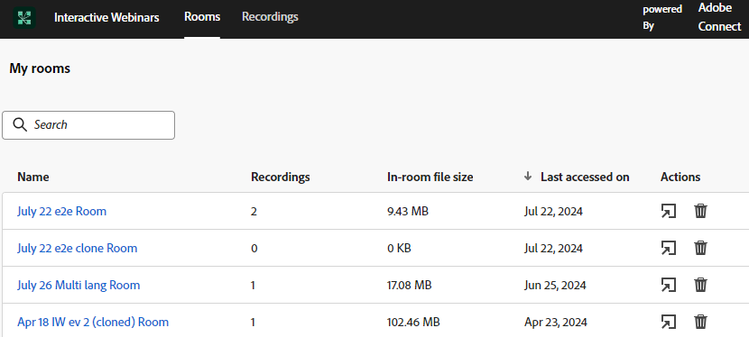
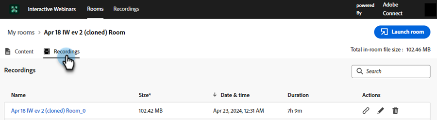

# Administración de salas {#room-management}

Las salas de seminarios web interactivos con tecnología de Adobe Connect están diseñadas para facilitar eventos en línea atractivos y colaborativos. Estos seminarios web almacenan contenido y grabaciones creadas y utilizadas durante el seminario web. Como miembro con derecho a crear una sala, puede acceder a ella y administrarla desde una ubicación central.

>[!NOTE]
>
>Solo puede acceder a las salas que ha creado para un seminario web y no a las salas de otros miembros de su organización.

## Administrar y acceder a salas y grabaciones {#manage-and-access-rooms-and-recordings}

1. Vaya a **[!UICONTROL Design Studio]**.

   

1. Seleccione **[!UICONTROL seminarios web interactivos]** y luego **[!UICONTROL Administrar salas]**.

   

### Habitaciones {#rooms}

Una sala interactiva de seminarios web es un espacio virtual diseñado para albergar eventos en vivo, atractivos y en línea donde los participantes pueden interactuar con el presentador y otros participantes. En estas salas, puede encontrar el contenido cargado y las grabaciones de seminarios web.

Para ver la lista de todas tus habitaciones, selecciona **[!UICONTROL Habitaciones]** en la barra de menús superior. Puedes encontrar todas las salas que creaste junto con el contenido cargado y las grabaciones en estas salas. También puede ver el número de grabaciones, el tamaño del archivo en la habitación y la fecha del último acceso para las habitaciones correspondientes.

<table><tbody>
  <tr>
    <td><b>Grabaciones</td>
    <td>Ver el número de grabaciones disponibles en una habitación.</td>
  </tr>
  <tr>
    <td><b>Tamaño de archivo en la habitación</td>
    <td>Ver el tamaño de archivo combinado del contenido y las grabaciones disponibles en una sala.</td>
  </tr>
  <tr>
    <td><b>Último acceso el</td>
    <td>Muestra la fecha en la que se accedió por última vez a la sala. Puede ordenar la información en función de la cronología.</td>
  </tr>
</tbody>
</table>

Puede realizar las siguientes acciones desde esta interfaz centralizada:

* Haga clic en el icono de la sala de Launch para iniciar y entrar en la sala.
* Utilice la barra de búsqueda para encontrar la habitación que está buscando (sólo buscará en las habitaciones que ha creado).
* Haga clic en el icono Eliminar sala para eliminar la sala. Al hacerlo, se eliminarán todas las grabaciones y archivos relacionados con la sala.

Al seleccionar una sala, puede ver el contenido o las grabaciones disponibles en ella. En esta pantalla, la información está disponible en dos fichas: la ficha **Contenido** y la ficha **Grabaciones**.

**Pestaña Contenido**

La pestaña Content permite ver los archivos cargados, su tipo, tamaño, fecha de último acceso y fecha de carga.

<table><tbody>
  <tr>
    <td><b>Tipo</td>
    <td>Muestra el tipo de archivo, como PDF, JPG, PNG, etc.</td>
  </tr>
  <tr>
    <td><b>Tamaño</td>
    <td>Ver el tamaño del archivo disponible.</td>
  </tr>
  <tr>
    <td><b>Último acceso el</td>
    <td>Muestra la última fecha de acceso a la sala. Puede ordenar la información en función de la cronología.</td>
  </tr>
  <tr>
    <td><b>Cargado</td>
    <td>Muestra cuándo se cargó el archivo.</td>
  </tr>
</tbody>
</table>

Puede realizar las siguientes acciones en la pestaña Content:

* Haga clic en el botón **[!UICONTROL Sala de lanzamiento]** para iniciar e ingresar a la sala.
* Utilice la barra de búsqueda para encontrar el archivo que está buscando.
* Haga clic en el icono Descargar archivo para descargar un archivo en el dispositivo. Seleccione dos o más archivos para descargarlos por lotes.
* Haga clic en el icono Eliminar sala para eliminar la sala. Cuando se elimina un archivo, no se puede recuperar.
* Seleccione cualquier archivo del contenido de la lista para verlo en el dispositivo.

**Ficha Grabaciones**

La ficha Grabaciones permite ver todas las grabaciones disponibles en esta sala. Cada grabación se muestra con detalles como su tamaño, fecha y hora de grabación y duración.

Puede realizar las siguientes acciones desde este concentrador centralizado:

* Haga clic en el botón **[!UICONTROL Sala de lanzamiento]** para iniciar e ingresar a la sala.
* Utilice la barra de búsqueda para encontrar la grabación que está buscando.
* Haga clic en el icono Descargar archivo para descargar un archivo en el dispositivo. Seleccione dos o más archivos para descargarlos por lotes.
* Haga clic en el icono Copiar vínculo de grabación para copiar la URL de grabación.
* Haga clic en el icono Editar grabación para realizar cambios en la grabación.
* Haga clic en el icono Eliminar para eliminar la grabación. Cuando se elimina una grabación, no se puede recuperar.
* Seleccione una grabación para reproducirla en el dispositivo.

## Administrar y acceder a grabaciones {#manage-and-access-recordings}

Las grabaciones son recursos inestimables que capturan la esencia de los debates en directo, las presentaciones y las sesiones de preguntas y respuestas. Permiten a los participantes revisar perspectivas clave, detalles perdidos o conceptos complejos a su propio ritmo.

Haga clic en la ficha **[!UICONTROL Grabaciones]** para ver una lista de todas las grabaciones que ha cargado.

En **[!UICONTROL Mis grabaciones]**, encontrará todas las grabaciones disponibles en la sala que creó. También puede ver su tamaño, fecha y hora y duración respectivos de las grabaciones.

Puede realizar las siguientes acciones desde este concentrador centralizado:

* Utilice la barra de búsqueda para encontrar la grabación que está buscando. También puede buscar dentro de una cronología seleccionando un Intervalo de fechas.
* Haga clic en el icono Copiar vínculo de grabación para copiar la URL de grabación.
* Haga clic en el icono Editar grabación para realizar cambios en la grabación.
* Haga clic en el icono Mostrar página vinculada para ver la información sobre la sala donde está disponible la grabación seleccionada.
* Haga clic en el icono Eliminar para eliminar la grabación. Cuando se elimina una grabación, no se puede recuperar.
* Seleccione una grabación para reproducirla en el dispositivo.
