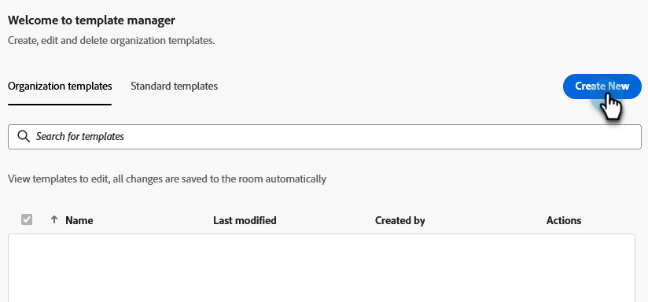

# Plantillas para seminarios web interactivos {#templates-for-interactive-webinars}

Cree plantillas fáciles de usar en los seminarios web interactivos para producir contenido más rápido y mantenerse en línea con las directrices de marca al trabajar en equipo.

## Conceder permisos {#grant-permissions}

Antes de que cualquier usuario de su organización tenga la capacidad de acceder a las plantillas de los seminarios web interactivos, un administrador de Marketo Engage debe añadir acceso a las funciones deseadas.

1. En Marketo Engage, haga clic en **[!UICONTROL Administrador]**.

   

1. Haga clic en **[!UICONTROL Usuarios y roles]** y, a continuación, en la ficha **[!UICONTROL Roles]**.

   

1. Haga doble clic en la función a la que desee agregar los permisos.

   

1. Haga clic para abrir **[!UICONTROL Access Design Studio]**.

   

1. Seleccione la casilla de verificación **[!UICONTROL Acceder a plantillas de seminarios web interactivos]**.

   

## Crear una plantilla {#create-a-template}

1. En Marketo Engage, haga clic en **[!UICONTROL Design Studio]**.

   

1. Haga clic en **[!UICONTROL seminarios web interactivos]**.

   

1. Haga clic en **[!UICONTROL Administrar plantillas]**.

   

1. Se abre una nueva pestaña. Haga clic en **Crear nuevo**.

   

1. En la pestaña Plantillas estándar, seleccione la plantilla que desee y haga clic en **Siguiente**.

   

   >[!NOTE]
   >
   >Las plantillas de organización son las plantillas que usted o su equipo ya han creado.

1. Introduzca un nombre y una descripción. Haz clic en **Guardar y abrir**.

   

1. Se abre una nueva pestaña. Para editar o guardar la plantilla, debe introducir una sala. Como no se trata de una sala de seminarios web real, no es necesario realizar selecciones de audio/vídeo. Haga clic en **Introducir sala**.

   

1. Realice los cambios que desee en la plantilla existente.

   

1. En el menú Salir de la parte superior derecha, seleccione **Finalizar sesión para todos**.

   

1. Haga clic en **Finalizar ahora**.

   

La plantilla se guardará automáticamente.

## Editar una plantilla {#edit-a-template}

Siga los pasos a continuación para editar una plantilla existente.

1. En Marketo Engage, haga clic en **[!UICONTROL Design Studio]**.

   

1. Haga clic en **[!UICONTROL seminarios web interactivos]**.

   

1. Haga clic en **[!UICONTROL Administrar plantillas]**.

   

1. Se abre una nueva pestaña. Busque la plantilla que desee editar y haga clic en el icono de apertura.

   

1. Se abre una nueva pestaña. Para editar la plantilla, tendrá que introducir una sala. Como no se trata de una sala de seminarios web real, no es necesario realizar selecciones de audio/vídeo. Haga clic en **Introducir sala**.

   

1. Realice los cambios que desee en la plantilla.

   

1. En el menú Salir de la parte superior derecha, seleccione **Finalizar sesión para todos**.

   

1. Haga clic en **Finalizar ahora**.

   

Los cambios se guardarán automáticamente.
