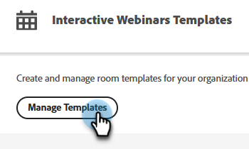

# Plantillas para seminarios web interactivos {#templates-for-interactive-webinars}

Cree plantillas fáciles de usar en los seminarios web interactivos para producir contenido más rápido y mantenerse en línea con las directrices de marca al trabajar en equipo.

## Crear una plantilla {#create-a-template}

1. En Marketo Engage, haga clic en **[!UICONTROL Design Studio]**.

   

1. Clic **[!UICONTROL Seminarios web interactivos]**.

   

1. Clic **[!UICONTROL Administrar plantillas]**.

   

1. Se abre una nueva pestaña. Clic **Crear nuevo**.

   

1. En la pestaña Plantillas estándar, seleccione la plantilla que desee y haga clic en **Siguiente**.

   

   >[!NOTE]
   >
   >Las plantillas de organización son las plantillas que usted o su equipo ya han creado.

1. Introduzca un nombre y una descripción. Clic **Guardar y abrir**.

   

1. Se abre una nueva pestaña. Para editar o guardar la plantilla, debe introducir una sala. Como no se trata de una sala de seminarios web real, no es necesario realizar selecciones de audio/vídeo. Clic **Entrar en sala**.

   

1. Realice los cambios que desee en la plantilla existente.

   

1. En el menú Salir de la parte superior derecha, seleccione **Finalizar sesión para todos**.

   

1. Clic **Finalizar ahora**.

   

La plantilla se guardará automáticamente.

## Editar una plantilla {#edit-a-template}

Siga los pasos a continuación para editar una plantilla existente.

1. En Marketo Engage, haga clic en **[!UICONTROL Design Studio]**.

   

1. Clic **[!UICONTROL Seminarios web interactivos]**.

   

1. Clic **[!UICONTROL Administrar plantillas]**.

   

1. Se abre una nueva pestaña. Busque la plantilla que desee editar y haga clic en el icono de apertura.

   

1. Se abre una nueva pestaña. Para editar la plantilla, tendrá que introducir una sala. Como no se trata de una sala de seminarios web real, no es necesario realizar selecciones de audio/vídeo. Clic **Entrar en sala**.

   

1. Realice los cambios que desee en la plantilla.

   

1. En el menú Salir de la parte superior derecha, seleccione **Finalizar sesión para todos**.

   

1. Clic **Finalizar ahora**.

   

Los cambios se guardarán automáticamente.
