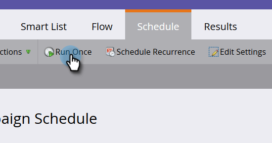

# Añadir miembros a un Programa de Evento {#adding-members-to-an-event-program}

Este artículo solo se aplica a los usuarios que utilizan los Objetivos de Evento o Límite de Eventos.

>[!CAUTION]
>
>La importación de una lista de personas directamente en un Programa de Evento impedirá que esos registros se cuenten en los registros reales en el informe Seguimiento de objetivos y en el informe Progresión de límite de Eventos. Siga las instrucciones que se indican a continuación para asegurarse de que se cuentan sus registros.

1. Cree y [agregue personas a una lista](http://docs.marketo.com/x/ecKt)estática.
1. [Cree una campaña](http://docs.marketo.com/x/M4AR)inteligente.
1. En la Lista inteligente de la Campaña inteligente que ha creado en el paso dos, busque y agregue el filtro **Miembro de Lista** .

   

1. Busque y seleccione la lista que creó en el paso uno.
1. 

1. En Flujo, busque y agregue el paso **Cambiar estado** de Programa.
1. 

1. Busque y seleccione su Programa de Evento.

   

1. Elija el estado que desee.

   

1. En la ficha Programación, haga clic en **Ejecutar una vez**.
1. 

1. Seleccione **Ejecutar ahora** y haga clic en **Ejecutar**.
1. 

1. Una vez ejecutada la campaña inteligente, los miembros se agregan al programa y se contarán en los cálculos de Seguimiento de objetivos y Progreso de límite de Evento.

