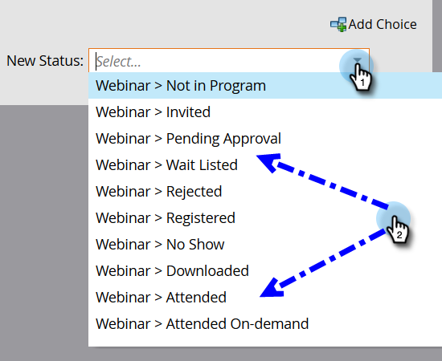

# Adición de miembros a un programa de eventos {#adding-members-to-an-event-program}

Este artículo solo se aplica a los usuarios que utilizan el Límite de eventos o los Objetivos de eventos.

>[!CAUTION]
>
>La importación de una lista de personas directamente en un programa de eventos evitará que esos registros se cuenten en registros reales en los informes Seguimiento de objetivos y Progresión del límite de eventos. Siga las instrucciones que se indican a continuación para asegurarse de que se cuentan sus registros.

1. Crear y [agregar personas a una lista estática](/help/marketo/product-docs/core-marketo-concepts/smart-lists-and-static-lists/static-lists/create-a-static-list.md).

1. [Crear una campaña inteligente](/help/marketo/product-docs/core-marketo-concepts/smart-campaigns/creating-a-smart-campaign/create-a-new-smart-campaign.md).

1. En la lista inteligente de la campaña inteligente que creó en el paso 2, busque y agregue el filtro **Miembro de la lista**.

   

1. Busque y seleccione la lista que creó en el paso uno.

   

1. En el flujo, busque y agregue el paso de flujo **Cambiar estado del programa**.

   

1. Busque y seleccione su programa de eventos.

   

1. Elija el estado que desee.

   

1. En la ficha Programación, haga clic en **Ejecutar una vez**.

   

1. Seleccione **Ejecutar ahora** y haga clic en **Ejecutar**.

   

1. Después de que se ejecute la campaña inteligente, los miembros se agregan al programa y contarán en los cálculos Seguimiento de objetivos y Progresión del límite de eventos.
