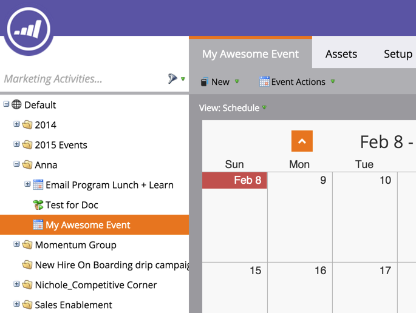

# Crear un nuevo Programa de Evento {#create-a-new-event-program}

¡Los eventos le permiten automatizar eventos en línea y sin conexión! Capture el estado de sus personas a medida que avanzan en diferentes etapas y obtenga mediciones precisas del ROI para sus iniciativas de mercadotecnia.

1. Vaya a **Actividades de marketing**.

   

1. Seleccione la carpeta para el nuevo programa. Seleccione **Nuevo** y haga clic en **Nuevo Programa**.

   

1. Elija un nombre para el evento. A continuación, en **Tipo de Programa**, seleccione **Evento**.

   

1. Seleccione un **Canal**.

   >[!NOTE]
   >
   >Los canales definen los distintos estados que puede tener una persona en un programa. Obtenga más información sobre [membresía de programa](/help/marketo/product-docs/core-marketo-concepts/programs/creating-programs/understanding-program-membership.md) aquí.

   

1. Haga clic en **Crear**.

   

   ¡Ta-da! El nuevo evento aparecerá en el árbol.

   

1. Para programar el evento, seleccione **Programar Vista** y haga clic en ella en el calendario para abrir la ventana emergente. Introduzca fechas y horas.

   

1. Deslice la barra a **Confirmada** cuando haya terminado.

   

Una vez creado el evento, cree las [páginas de aterrizaje](/help/marketo/product-docs/demand-generation/landing-pages/free-form-landing-pages/create-a-free-form-landing-page.md), [formularios](/help/marketo/product-docs/demand-generation/forms/creating-a-form/create-a-form.md) y [correos](/help/marketo/product-docs/email-marketing/email-programs/creating-an-email-program/create-an-email-program.md) para invitar a sus invitados. También querrá familiarizarse con la vista [calandario del programa](https://docs.marketo.com/display/docs/program+schedule+view).

>[!MORELIKETHIS]
>
>* [Calendario de mercadotecnia](/help/marketo/product-docs/core-marketo-concepts/marketing-calendar/understanding-the-calendar/navigating-the-marketing-calendar.md)
>* [Uso de los costos de período en un Programa](/help/marketo/product-docs/core-marketo-concepts/programs/working-with-programs/using-period-costs-in-a-program.md)

