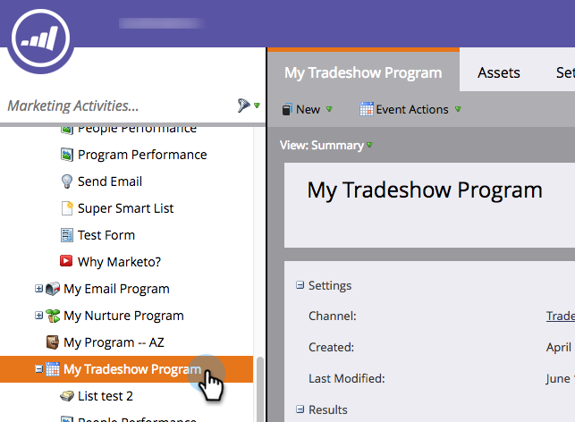
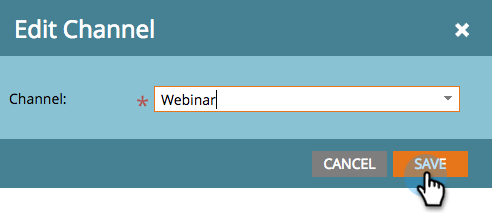

# Editar un canal de eventos {#edit-an-event-channel}

Puede editar el tipo de canal desde la pestaña **Resumen** del evento o desde su pestaña **Configuración**.

>[!NOTE]
>
>Esta opción sólo está disponible para eventos que no tienen miembros asociados. Una vez que un evento tiene miembros, no se puede cambiar el tipo de canal.

>[!NOTE]
>
>Un programa es una iniciativa de marketing específica. El **canal** está diseñado para ser el mecanismo de entrega, como seminario web, feria comercial o anuncio en línea. Puede ver diferentes opciones de canal en la lista desplegable, según lo que esté disponible en su propia instancia. También puedes [crear tu propio canal](/help/marketo/product-docs/administration/tags/create-a-program-channel.md).

## Desde la pestaña Resumen {#from-the-summary-tab}

1. En **[!UICONTROL Actividades de mercadotecnia]**, seleccione el evento en el árbol.

   

1. Vaya a la vista **[!UICONTROL Resumen]**.

   

1. En la categoría **[!UICONTROL Configuración]**, seleccione el **[!UICONTROL canal]** actual que se muestra como un hipervínculo.

   

1. En la lista desplegable, selecciona un nuevo **[!UICONTROL canal]**.

   

1. Haga clic en **[!UICONTROL Guardar]**.

   

## Desde la pestaña Configuración {#from-the-setup-tab}

También se puede asignar un nuevo tipo de canal desde la ficha **[!UICONTROL Configuración]** del evento.

1. Seleccione el evento en el árbol.

   

1. Vaya a la ficha **[!UICONTROL Configuración]**. Haga doble clic en el **canal** actual.

   

1. Seleccione un nuevo **[!UICONTROL canal]**.

   

1. Haga clic en **[!UICONTROL Guardar]**.

   

El canal se ha editado.
