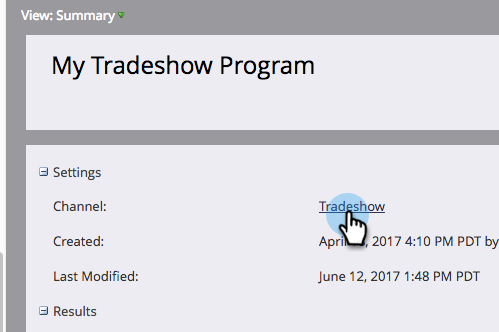

# Editar un canal de eventos {#edit-an-event-channel}

Puede editar el tipo de canal desde el evento **Resumen** o desde su **Configuración** pestaña .

>[!NOTE]
>
>Esta opción solo está disponible para eventos que no tienen miembros asociados. Una vez que un evento tiene miembros, no se puede cambiar el tipo de canal.

>[!NOTE]
>
>Un programa es una iniciativa de marketing específica. La variable **canal** está diseñado para ser el mecanismo de entrega, como seminario web, presentación de ofertas o publicidad en línea. Puede ver diferentes opciones de canal en la lista desplegable, según lo que esté disponible en su propia instancia. También puede  [crear su propio canal](/help/marketo/product-docs/administration/tags/create-a-program-channel.md).

## En la ficha Resumen {#from-the-summary-tab}

1. De **Actividades de marketing**, seleccione el evento en el árbol.

   

1. Vaya a la **Resumen** vista.

   

1. En el **Configuración** seleccione la categoría actual **Canal** se muestra como un hipervínculo.

   

1. En la lista desplegable, seleccione un canal nuevo.

   

1. Haga clic en **Guardar**.

   

## Desde la ficha Configuración {#from-the-setup-tab}

También se puede asignar un nuevo tipo de canal desde el evento **Configuración** pestaña .

1. Seleccione el evento en el árbol.

   

1. Vaya a la **Configuración** pestaña . Haga doble clic en la **Canal**.

   

1. Seleccione un nuevo **Canal**.

   

1. Haga clic en **Guardar**.

   

¡Felicidades! Acaba de editar un canal.
