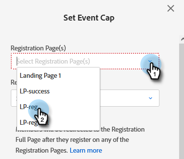

# Configuración de un límite de evento {#setting-an-event-cap}

Limite la cantidad de personas que se pueden registrar para su evento con un límite de evento.

>[!NOTE]
>
>No todos han comprado esta función. Póngase en contacto con el equipo de cuenta de Adobe (su administrador de cuentas) para obtener más información.

>[!IMPORTANT]
>Debe tener al menos dos páginas de aterrizaje aprobadas (una página de registro y una página de registro completo) en el programa para poder establecer un límite de evento.

>[!NOTE]
>
>Para liberar espacio en un evento, se debe eliminar el miembro del programa (para ello, actualice su estado a No está en el programa).

1. Seleccione el programa de eventos.

   

1. En la Información general, busque [!UICONTROL Límite de evento] y haga clic en **[!UICONTROL No definido]**.

   

1. Introduzca la cantidad máxima de personas que desea registrar para su evento y haga clic en **[!UICONTROL Siguiente]**.

   

1. Haga clic en [!UICONTROL Página de registro] y seleccione la página de aterrizaje que actuará como página de registro.

   

1. Haga clic en **[!UICONTROL Página completa de registro]** y seleccione la página de aterrizaje que actuará como página de registro completa. Clic **[!UICONTROL Establecer y habilitar]** cuando termine.

   

   Ya está todo listo. Si decide que desea editar los detalles del límite del evento, haga clic en el texto azul situado junto a [!UICONTROL Límite de evento].

   
