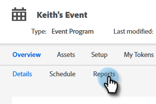
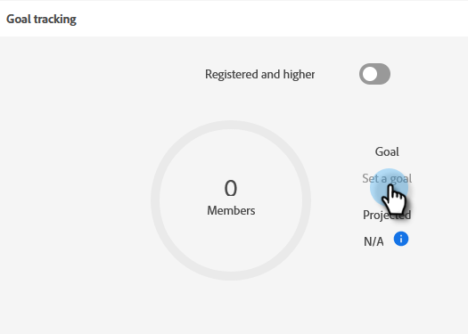

# Configuración de objetivos de evento {#setting-event-goals}

Asigne objetivos específicos a los eventos y vea cómo funcionan.

>[!IMPORTANT]
>No todos los clientes tienen acceso a esta función. Póngase en contacto con el gestor de éxito de los clientes para obtener más información.

1. Cree un programa de eventos.

   

1. Elija la [!UICONTROL Carpeta de campaña], asigne a su evento un [!UICONTROL Nombre], seleccione [!UICONTROL Tipo de programa] y [!UICONTROL Canal]. Haga clic en **[!UICONTROL Crear]** cuando haya terminado.

   

1. En el evento , haga clic en el botón **[!UICONTROL Informes]** pestaña .

   

1. Especifique el objetivo para [!UICONTROL Registrados] haciendo clic en **[!UICONTROL Establecer un objetivo]**. Escriba el número en y pulse Intro.

   

   

1. Repita los mismos pasos para [!UICONTROL Asistida].

   

>[!NOTE]
>
>No se pueden establecer objetivos para un evento después de iniciarlo.

¡Y eso es todo! Compruebe el estado del objetivo del evento haciendo clic en la variable [!UICONTROL Informes] pestaña .
