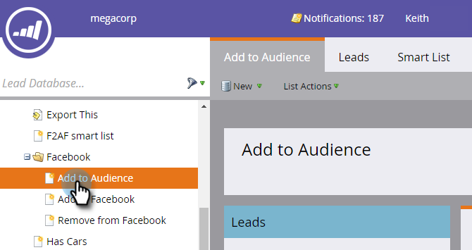

# Añadir posibles clientes a una audiencia personalizada en Facebook {#add-leads-to-a-custom-audience-in-facebook}

¿Ya tiene una audiencia personalizada en Facebook y desea agregar más posibles clientes? Así es como.

>[!PREREQUISITES]
>
>* [Crear una audiencia personalizada en Facebook](/help/marketo/product-docs/demand-generation/facebook/create-a-custom-audience-in-facebook.md)
>* [Aceptar términos de audiencias personalizados de Facebook](https://www.facebook.com/ads/manage/customaudiences/tos.php) en su cuenta de Facebook.
>

1. Busque y seleccione la lista inteligente o estática que contiene los posibles clientes que desea agregar.

   

1. Seleccione el **Posibles clientes** y, a continuación, haga clic en la pestaña **Enviar mediante puente publicitario** en la parte inferior.

   

1. Select **Facebook** y haga clic en **Siguiente**.

   

1. Haga clic en el **Audiencia** , seleccione la audiencia a la que desee agregar los posibles clientes y haga clic en **Actualizar**.

   

   >[!NOTE]
   >
   >**Añadir posibles clientes a la audiencia**: solo estarán disponibles las audiencias de Facebook con un subtipo personalizado.\
   >**Eliminar posibles clientes de la audiencia**: elimina los posibles clientes de la lista estática o inteligente de una audiencia de Facebook.

1. Cuando termine, el estado se actualizará.

   

   ¡Eso es todo!

   >[!NOTE]
   >
   >[Crear una audiencia personalizada en Facebook](/help/marketo/product-docs/demand-generation/facebook/create-a-custom-audience-in-facebook.md)
