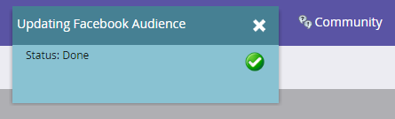

# Agregar posibles clientes a una audiencia personalizada en [!DNL Facebook] {#add-leads-to-a-custom-audience-in-facebook}

Para añadir posibles clientes a una audiencia personalizada existente, siga estos pasos.

>[!PREREQUISITES]
>
>* [Crear una audiencia personalizada en [!DNL Facebook]](/help/marketo/product-docs/demand-generation/facebook/create-a-custom-audience-in-facebook.md)
>* [Acepta los términos de audiencias personalizados de  [!DNL Facebook]](https://www.facebook.com/ads/manage/customaudiences/tos.php) en tu cuenta de [!DNL Facebook].
>

1. Busque y seleccione la lista inteligente o estática que contiene los posibles clientes que desea agregar.

   

1. Seleccione la ficha **[!UICONTROL Posibles clientes]** y luego haga clic en el icono **Enviar a través de Ad Bridge** de la parte inferior.

   

1. Seleccione **[!UICONTROL Facebook]** y haga clic en **[!UICONTROL Siguiente]**.

   

1. Haga clic en el menú desplegable **[!UICONTROL Audiencia]**, seleccione la audiencia a la que desee agregar los posibles clientes y haga clic en **[!UICONTROL Actualizar]**.

   

   >[!NOTE]
   >
   >**[!UICONTROL Agregar posibles clientes a la audiencia]**: solo estarán disponibles [!DNL Facebook] audiencias con un subtipo personalizado.
   >**[!UICONTROL Quitar posibles clientes de la audiencia]**: quita los posibles clientes de la lista estática o inteligente de una audiencia [!DNL Facebook].

1. Cuando termine, el estado se actualizará.

   

   El proceso ha finalizado.

   >[!NOTE]
   >
   >[Crear una audiencia personalizada en [!DNL Facebook]](/help/marketo/product-docs/demand-generation/facebook/create-a-custom-audience-in-facebook.md)
