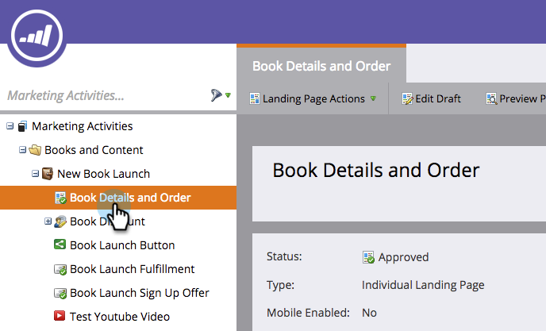
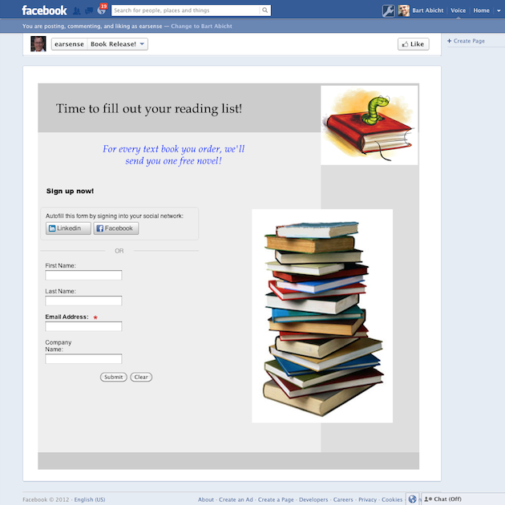

# Publicar páginas de aterrizaje en Facebook {#publish-landing-pages-to-facebook}

Puede publicar sus páginas de aterrizaje en Facebook, conocer a su audiencia donde ya se hayan pasado y generar más tráfico para sus programas.

>[!AVAILABILITY]
>
>SMB Spark, Standard y Select. Empresa con función de licencia independiente.

>[!PREREQUISITES]
>
>Su página debe tener al menos 2000 &quot;Me gusta&quot; antes de poder publicar en Facebook.

Supongamos que está lanzando un nuevo libro, puede que llegue a algunos de sus visitantes a través de correo electrónico y sitio web. La publicación de una página de aterrizaje de Marketo adicionalmente a su página de marca de Facebook llega a una audiencia mayor y alienta a compartir la oferta.

1. Seleccione una página de aterrizaje aprobada.

   

1. Select **Publicar en Facebook** desde Acciones de página de aterrizaje.

   

   >[!NOTE]
   >
   >Esta técnica publica la página de aterrizaje en una aplicación de Facebook (anteriormente denominada ficha de Facebook). Como las aplicaciones de Facebook no están disponibles en dispositivos móviles, esta técnica no funcionará cuando el visitante intente acceder a la página de aterrizaje publicada en una aplicación de Facebook en un dispositivo móvil.

1. Autorice Marketo para publicar en su página de Facebook.

   

1. Introduzca sus credenciales de Facebook.

   

   >[!NOTE]
   >
   >Deberá utilizar una cuenta que tenga permisos de administrador para la página de Facebook en la que desee publicar la página de aterrizaje de Marketo.

1. Seleccione el **Página de facebook** donde desea publicar la página de aterrizaje e introduzca el nombre con el que debe aparecer la página de aterrizaje de Marketo.

   

   >[!NOTE]
   >
   >Para reemplazar páginas de aterrizaje de Marketo que haya publicado anteriormente en Facebook, seleccione **Reemplazar ficha existente** y seleccione la pestaña que desea reemplazar en la lista desplegable. Tenga en cuenta que esto no reemplaza las pestañas que no sean de Marketo.

1. Los posibles clientes ahora pueden visitar la página de aterrizaje directamente en la página de Facebook. Simplemente haga clic en el nombre de la ficha debajo de la imagen de portada.

   

   >[!NOTE]
   >
   >Para eliminar la página de aterrizaje de Facebook, desaprobarla en Marketo y, cuando se le solicite, seleccione la opción para eliminar la pestaña Facebook .
