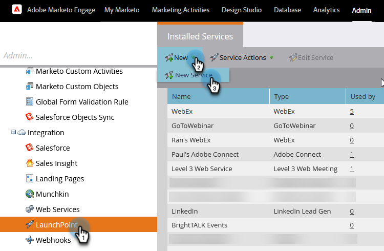
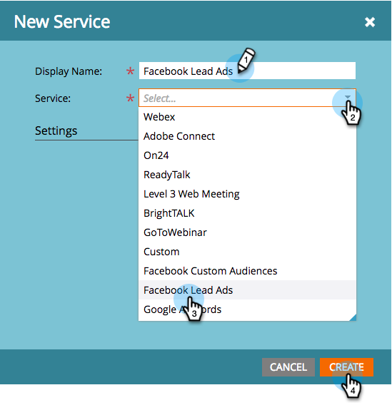

# Configurar anuncios de posibles clientes de Facebook {#set-up-facebook-lead-ads}

Use [Anuncios de clientes potenciales de Facebook](https://www.facebook.com/business/ads/ad-objectives/lead-generation){target="_blank"} para ejecutar campañas de anuncios en Facebook y generar clientes potenciales para Marketo.

>[!NOTE]
>
>**Se requieren permisos de administración**

>[!AVAILABILITY]
>
>Para que Facebook Lead Ads se añada a su instancia, póngase en contacto con el equipo de cuenta de Adobe (su administrador de cuentas).

1. En Marketo Engage, vaya al área **Admin**.

   

1. Vaya a **LaunchPoint**, haga clic en la lista desplegable **Nuevo** y seleccione **Nuevo servicio**.

   

1. Escriba un **Nombre para mostrar** para su servicio, seleccione el servicio **Anuncios de posibles clientes de Facebook** en la lista desplegable y haga clic en **Crear**.

   

1. Abra una ficha nueva en el mismo explorador y vaya a [facebook.com](https://www.facebook.com){target="_blank"}. Inicie sesión en Facebook con la cuenta que desee utilizar para la integración.

   >[!NOTE]
   >
   >La cuenta de Facebook necesitará acceso a todas las páginas comerciales de Facebook de las que quiera extraer anuncios de posibles clientes.

   

1. Cuando hayas iniciado sesión en Facebook, vuelve a Marketo y haz clic en **Autorizar**.

   

1. Si se le solicita, haga clic en **Aceptar** para aceptar la instalación de la aplicación Marketo en Facebook.

   

1. Verá que ahora está autorizado. Haga clic en **Siguiente**.

   

1. Seleccione las páginas de las que quiera que Marketo extraiga anuncios de posibles clientes de Facebook y haga clic en **Siguiente**.

   >[!TIP]
   >
   >Si no ve una página que esté esperando, asegúrese de que la cuenta de Facebook utilizada para autenticarse se agregue a la página en Facebook e inténtelo de nuevo.

   

1. Para aceptar las asignaciones predeterminadas de campos de Facebook a Marketo, simplemente haga clic en **Crear**.

   >[!TIP]
   >
   >Al modificar las asignaciones, puede personalizar dónde se almacenan los datos de los anuncios potenciales en Marketo. También puede [extraer datos de las preguntas personalizadas de los anuncios de posibles clientes](/help/marketo/product-docs/demand-generation/facebook/set-up-facebook-lead-ads/map-custom-fields-to-marketo.md){target="_blank"}.

   >[!CAUTION]
   >
   >Marketo no admite la asignación de dos campos de Facebook a un único campo de Marketo, solo de 1 a 1. Si asigna 2 a 1, es posible que los posibles clientes no entren en el sistema Marketo.

   

   ¡Bien hecho! Los posibles clientes comenzarán a entrar en Marketo a medida que ejecute campañas de anuncios de posibles clientes exitosas.

   

>[!MORELIKETHIS]
>
>* [Asignar o quitar permisos en el Administrador de acceso de posibles clientes (Facebook)](https://www.facebook.com/business/help/540596413257598?id=735435806665862){target="_blank"}
>* [Usar filtros y Déclencheur de anuncios de posibles clientes en una campaña inteligente](/help/marketo/product-docs/demand-generation/facebook/use-lead-ads-filters-and-triggers-in-a-smart-campaign.md){target="_blank"}
>* [Asignar campos personalizados a Marketo](/help/marketo/product-docs/demand-generation/facebook/set-up-facebook-lead-ads/map-custom-fields-to-marketo.md){target="_blank"}
