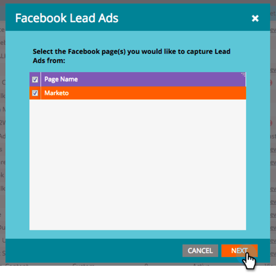
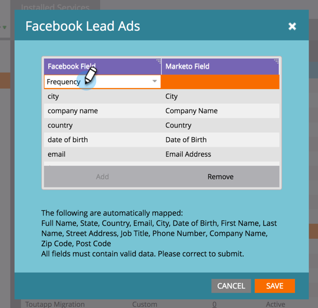

# Asignar campos personalizados a Marketo {#map-custom-fields-to-marketo}

Es posible que desee recopilar más de la información estándar que [!DNL Facebook] almacena de forma predeterminada, como la frecuencia con la que alguien usa su servicio de envío en línea. Puede lograr esto [creando preguntas personalizadas](https://www.facebook.com/business/help/774623835981457?helpref=uf_permalink) en sus [!DNL Facebook] anuncios de posibles clientes.

Sin embargo, **Marketo no comenzará a recopilar automáticamente estos datos**. Para que Marketo empiece a capturar valores de campos personalizados, **debe** asignar esos campos personalizados a un campo de Marketo.

Siga estos pasos para configurarlo en el área de LaunchPoint de Admin.

>[!NOTE]
>
>**Se requieren permisos de administrador**

1. Vaya al área de Administración y haga clic en **[!UICONTROL LaunchPoint]**. En Servicios instalados, busque y edite **[!UICONTROL Anuncios principales de Facebook]**.

   

1. Haga clic en **[!UICONTROL Next]**.

   

1. Deje la cuenta autorizada tal cual, **no** realiza ningún cambio. Haga clic en **[!UICONTROL Next]**.

   

1. Como antes, deje las páginas seleccionadas tal cual, **no** realice ningún cambio. Haga clic en **[!UICONTROL Next]**.

   

1. Asigne el campo personalizado [!DNL Facebook] al campo de Marketo. Haga clic en **[!UICONTROL Agregar].**

   

1. En la nueva fila, escriba el nombre del campo personalizado [!DNL Facebook].

   

   >[!NOTE]
   >
   >Solo los campos que se hayan guardado en [!DNL Facebook] plantillas de formulario aparecerán como opciones aquí.

1. Haga clic en la columna **[!UICONTROL Campo de Marketo]**. Escriba para buscar el campo al que desea asignar. Después de seleccionar un campo, haga clic en **[!UICONTROL Guardar]**.

   

   >[!NOTE]
   >
   >Si todavía no tiene un campo en Marketo al que asignar el campo [!DNL Facebook], aprenda a [crear campos personalizados](/help/marketo/product-docs/administration/field-management/create-a-custom-field-in-marketo.md).

>[!CAUTION]
>
>Usted **debe** pasar por este proceso para cualquier nuevo campo [!DNL Facebook] a fin de que Marketo recopile los datos.
