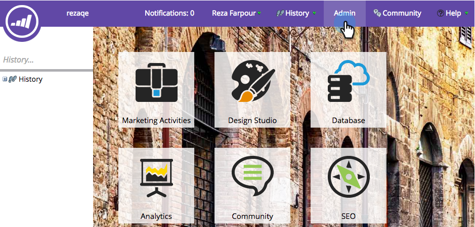
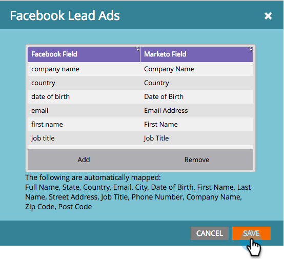

# Configurar [!DNL Facebook] conversiones sin conexión {#set-up-facebook-offline-conversions}

Al enviar los datos de conversión sin conexión de vuelta a [!DNL Facebook] para las personas creadas mediante anuncios de posibles clientes, su equipo de publicidad puede optimizar el gasto de su publicidad mejor que nunca. A continuación se muestra cómo configurarlo.

>[!PREREQUISITES]
>
>* Debe [configurar anuncios de clientes potenciales de Facebook](/help/marketo/product-docs/demand-generation/facebook/set-up-facebook-lead-ads.md).
>* Debe tener un modelo aprobado en [Modeler del ciclo de ingresos](/help/marketo/product-docs/reporting/revenue-cycle-analytics/revenue-cycle-models/understanding-revenue-models.md).

## Configuración de administración {#admin-configuration}

1. Vaya a Marketo **[!UICONTROL Admin]**.

   

1. Vaya a **[!UICONTROL LaunchPoint]** y haga doble clic en el servicio de anuncios de posibles clientes de Facebook que creó anteriormente.

   >[!NOTE]
   >
   >Si aún no lo has hecho, continúa y [configura [!UICONTROL anuncios de clientes potenciales de Facebook]](/help/marketo/product-docs/demand-generation/facebook/set-up-facebook-lead-ads.md), y vuelve aquí.

   

1. Si lo desea, edite el **[!UICONTROL Nombre para mostrar]** para incluir las conversiones sin conexión. Haga clic en **[!UICONTROL Siguiente]**.

   

1. Marque **[!UICONTROL Habilitar conversiones sin conexión]** y haga clic en **[!UICONTROL Siguiente]**.

   

1. Haga clic en **[!UICONTROL Siguiente]**.

   

1. Haga clic en **[!UICONTROL Guardar]**.

   

   ¡Dulce! Ya ha completado la mitad del proceso para habilitar [!DNL Facebook] conversiones sin conexión. Vamos a saltar a la Modeler del ciclo de ingresos para asignar las fases.

   

## Configuración de Modeler del ciclo de ingresos {#revenue-cycle-modeler-configuration}

1. Ir a **[!UICONTROL Analytics]**.

   

1. Seleccione el modelo y haga clic en **[!UICONTROL Editar borrador]**.

   

   >[!NOTE]
   >
   >Actualmente, hay 10 eventos [!DNL Facebook] a los cuales puede asignar etapas de ciclo de ingresos:
   >
   >* Adiciones de información de pago
   >* Agrega al carro
   >* Añade a la lista de deseos
   >* Registros completados
   >* Cierres de compra iniciados
   >* Persona
   >* Otro
   >* Comprar
   >* Búsquedas
   >* Vistas del contenido

1. Seleccione el escenario que desee asignar y, a continuación, en el menú desplegable **[!UICONTROL Conversión de Facebook]**, seleccione el evento [!DNL Facebook] al que desee asignarlo. Repita este paso para asignar todas las fases del equipo a las fases de conversión sin conexión en [!DNL Facebook].

   

1. Cuando haya terminado de asignar, cierre el modelo.

   

1. ¡Apruebe su modelo y ha terminado!

   

   Ahora, cuando los posibles clientes de Lead Ad alcancen las fases que ha asignado, las conversiones se enviarán a [!DNL Facebook] para sistema de informes.

   >[!CAUTION]
   >
   >Compruebe su cuenta de [!DNL Facebook] y asegúrese de que todos los [anuncios están asociados](https://www.facebook.com/business/url/?href=%2Fbusiness%2Fhelp%2Fwww%2F1776828022605281&cmsid&creative=link&creative_detail=advertiser-help-center&create_type&destination_cms_id&orig_http_referrer) al conjunto de eventos de conversiones sin conexión de Marketo. Si no es así, es posible que la atribución de publicidad no funcione.

   >[!NOTE]
   >
   >Los datos de conversión sin conexión se envían de Marketo a [!DNL Facebook] varias veces al día.

>[!MORELIKETHIS]
>
>[Explicación de [!DNL Facebook] conversiones sin conexión](/help/marketo/product-docs/demand-generation/facebook/understanding-facebook-offline-conversions.md)
