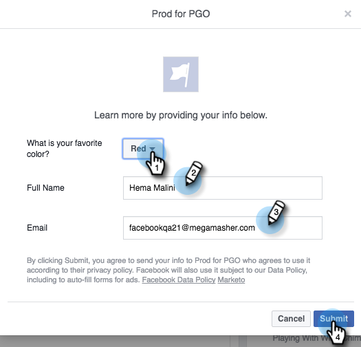

# Comprobación de anuncios de posibles clientes de Facebook para la integración de equipos de escritorio con Marketo {#test-facebook-lead-ads-for-desktop-integration-with-marketo}

Después de crear la publicidad de posible cliente, debe probarla. Así es como hacerlo en su escritorio.

>[!PREREQUISITES]
>
>Debe [Configuración de la integración de Facebook Lead Ads](/help/marketo/product-docs/demand-generation/facebook/set-up-facebook-lead-ads.md).

1. En Facebook Power Editor, seleccione una campaña, una publicidad y haga clic en **Editar**.

1. En **Vínculos**, haga clic en **Ver en la fuente de noticias** vínculo.

   

1. Se le dirigirá a Facebook en una nueva pestaña de su explorador. Haga clic en la Llamada a acción en la unidad de anuncio de posible cliente de Facebook.

   

   >[!NOTE]
   >
   >Este es solo un ejemplo, que utiliza una Llamada a acción Más información . Puede que la llamada a acción de la unidad de publicidad de posibles clientes sea diferente.

1. Envíe la unidad de prueba de Lead Ad rellenando el formulario en su escritorio. Haga clic en **Submit**.

   

1. Felicidades. Ya ha terminado de enviar el formulario de posibles clientes.

   

1. ¡Aquí es donde sucede la magia! Una vez enviado el formulario, [crear una lista inteligente en Marketo](/help/marketo/product-docs/core-marketo-concepts/smart-lists-and-static-lists/creating-a-smart-list/create-a-smart-list.md) como parte de un programa o en la base de datos que utiliza el filtro Formulario de anuncios de posibles clientes de Facebook rellenado . Inserte el Nombre del formulario de publicidad de posibles clientes del formulario que acaba de enviar.

   

1. A continuación, haga clic en el botón **People** para validar que la sincronización funciona correctamente.

   

   ¿Eso es genial o qué?

>[!MORELIKETHIS]
>
>[Configuración de anuncios de posibles clientes de Facebook](/help/marketo/product-docs/demand-generation/facebook/set-up-facebook-lead-ads.md)
