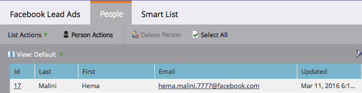

# Probar las publicidades de posible cliente de Facebook para la integración de escritorio con el producto de marketing {#test-facebook-lead-ads-for-desktop-integration-with-marketo}

Después de crear la publicidad de posibles clientes, debe probarla. Así es como hacerlo en su escritorio.

>[!PREREQUISITES]
>
>Debe [configurar la integración de publicidades de posibles clientes de Facebook](/help/marketo/product-docs/demand-generation/facebook/set-up-facebook-lead-ads.md).

1. En el Editor de energía de Facebook, seleccione una campaña, una publicidad y haga clic en **Editar**.

1. En **Vínculos**, haga clic en el vínculo **Vista en fuente de noticias**.

   

1. Se le dirigirá a Facebook en una nueva ficha de su explorador. Haga clic en Llamada a acción en la unidad Publicidad de posible cliente de Facebook.

   

   >[!NOTE]
   >
   >Este es sólo un ejemplo, que utiliza una llamada a acción &quot;Más información&quot;. La llamada a acción de la unidad de publicidad principal puede ser diferente.

1. Envíe la unidad de prueba de Lead Ad completando el formulario en su escritorio. Haga clic en **Enviar**.

   

1. Felicitaciones. Ha terminado de enviar el formulario de publicidad de posible cliente.

   

1. ¡Aquí es donde sucede la magia! Una vez que haya enviado el formulario, [genere una lista inteligente en Marketing](/help/marketo/product-docs/core-marketo-concepts/smart-lists-and-static-lists/creating-a-smart-list/create-a-smart-list.md) como parte de un programa o en la base de datos que utiliza el filtro Formulario de posibles clientes de Facebook rellenado. Inserte el nombre del formulario de publicidad de posibles clientes del formulario que acaba de enviar.

   

1. A continuación, haga clic en la ficha **Personas** para validar que la sincronización está funcionando correctamente.

   

   ¿Eso es genial o qué?

>[!MORELIKETHIS]
>
>[Configurar publicidades de posibles clientes de Facebook](/help/marketo/product-docs/demand-generation/facebook/set-up-facebook-lead-ads.md)
