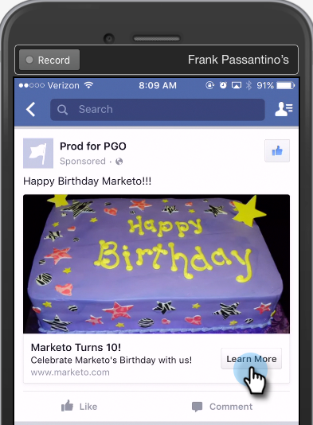

# Comprobación de anuncios de posibles clientes de Facebook para la integración móvil con Marketo {#test-facebook-lead-ads-for-mobile-integration-with-marketo}

Después de crear la publicidad de posible cliente, debe probarla.

>[!PREREQUISITES]
>
>Debe [Configuración de la integración de Facebook Lead Ads](/help/marketo/product-docs/demand-generation/facebook/set-up-facebook-lead-ads.md).

1. En Facebook Power Editor, seleccione una campaña, una publicidad y haga clic en **Editar**.

1. En **Vínculos**, haga clic en **Ver en aplicación móvil** vínculo.

   

1. Se enviará una nueva notificación a la cuenta de Facebook a la que podrá acceder desde el dispositivo móvil con la cuenta autorizada. Haga clic en **OK**.

   

1. En el dispositivo móvil, pulse **Notificaciones** en la aplicación móvil de Facebook.

   

1. En Notificaciones, pulse **Su publicidad está lista para la vista previa**.

   

1. Envíe la unidad de prueba de Lead Ad tocando su Llamada a acción y rellenando el formulario que ha creado.

   

   >[!NOTE]
   >
   >Este es solo un ejemplo, que utiliza una Llamada a acción Más información . Puede que la llamada a acción de la unidad de publicidad de posibles clientes sea diferente.

1. ¡Aquí es donde sucede la magia! Una vez enviado el formulario, [crear una lista inteligente en Marketo](/help/marketo/product-docs/core-marketo-concepts/smart-lists-and-static-lists/creating-a-smart-list/create-a-smart-list.md) como parte de un programa o en la base de datos de posibles clientes que usa la variable **Formulario de anuncios de posibles clientes de Facebook rellenado** filtro. Inserte el Nombre del formulario de publicidad de posibles clientes del formulario que acaba de enviar.

   

1. A continuación, haga clic en la pestaña Posibles clientes para validar que la sincronización funciona correctamente.

   

¿Eso es genial o qué?

>[!NOTE]
>
>[Habilitar/deshabilitar los anuncios de posibles clientes de Facebook](/help/marketo/product-docs/demand-generation/facebook/set-up-facebook-lead-ads.md)
