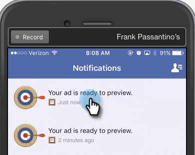

# Probar las publicidades de posibles clientes de Facebook para la integración móvil con el marketing {#test-facebook-lead-ads-for-mobile-integration-with-marketo}

Después de crear la publicidad de posibles clientes, debe probarla.

>[!PREREQUISITES]
>
>Debe [configurar la integración de publicidades de posibles clientes de Facebook](/help/marketo/product-docs/demand-generation/facebook/set-up-facebook-lead-ads.md).

1. En el Editor de energía de Facebook, seleccione una campaña, una publicidad y haga clic en **Editar**.

1. En **Vínculos**, haga clic en el vínculo **Vista en la aplicación móvil**.

   

1. Se enviará una nueva notificación a la cuenta de Facebook a la que puede acceder desde el dispositivo móvil con la cuenta autorizada. Haga clic en **Aceptar**.

   

1. En el dispositivo móvil, toque **Notificaciones** en la aplicación móvil de Facebook.

   

1. En Notificaciones, toque **Su publicidad está lista para la previsualización**.

   

1. Envíe la unidad de prueba de Lead Ad tocando la llamada a acción y rellenando el formulario que ha creado.

   

   >[!NOTE]
   >
   >Este es sólo un ejemplo, que utiliza una llamada a acción &quot;Más información&quot;. La llamada a acción de la unidad de publicidad principal puede ser diferente.

1. ¡Aquí es donde sucede la magia! Una vez que haya enviado el formulario, [genere una lista inteligente en Marketing](/help/marketo/product-docs/core-marketo-concepts/smart-lists-and-static-lists/creating-a-smart-list/create-a-smart-list.md) como parte de un programa o en la base de datos de posibles clientes que utiliza el filtro **Formulario de publicidades de posibles clientes de Facebook**. Inserte el nombre del formulario de publicidad de posibles clientes del formulario que acaba de enviar.

   

1. A continuación, haga clic en la ficha Posibles clientes para validar que la sincronización está funcionando correctamente.

   

¿Eso es genial o qué?

>[!NOTE]
>
>[Habilitar/deshabilitar publicidades de posibles clientes de Facebook](/help/marketo/product-docs/demand-generation/facebook/set-up-facebook-lead-ads.md)
