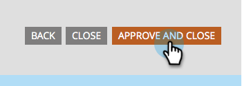

# Agregar un campo a un formulario {#add-a-field-to-a-form}

Una vez que [hayas creado tu formulario](/help/marketo/product-docs/demand-generation/forms/creating-a-form/create-a-form.md){target="_blank"} y [seleccionado un tema](/help/marketo/product-docs/demand-generation/forms/creating-a-form/select-a-form-theme.md){target="_blank"}, quizá quieras agregar campos adicionales para que las personas los rellenen. Así es como.

1. Vaya a **[!UICONTROL Actividades de marketing]**.

   

1. Seleccione el formulario y haga clic en **[!UICONTROL Editar borrador]**

   

   >[!NOTE]
   >
   >Si el formulario deseado tiene el estado _Aprobado_, primero debe hacer clic en **Crear borrador**.

1. En el formulario, haga clic en el signo **+**.

   

   >[!NOTE]
   >
   >Al crear un formulario nuevo, se agregan automáticamente [!UICONTROL Nombre], [!UICONTROL Apellidos] y [!UICONTROL Dirección de correo electrónico].

1. Busque y seleccione el campo que desee agregar al formulario.

   

1. Agregue todos los campos que necesite y haga clic en **[!UICONTROL Finalizar]**.

   

1. Haga clic en **[!UICONTROL Aprobar y cerrar]**.

   

>[!NOTE]
>
>Asegúrese de aprobar cualquier borrador de página de aterrizaje creado debido a los cambios del formulario.

>[!MORELIKETHIS]
>
>[Establecer como obligatorio un campo de formulario](/help/marketo/product-docs/demand-generation/forms/creating-a-form/make-a-form-field-required.md){target="_blank"}
