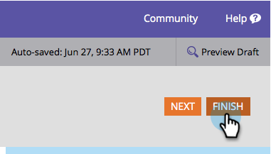

# Aprobar un formulario {#approve-a-form}

Para agregar un formulario a una de las páginas de aterrizaje, debe aprobarse. Así es como se hace.

## Aprobar un formulario {#approve-a-form-1}

A continuación se indica cómo aprobar un formulario existente que esté listo para utilizarse.

1. Vaya a **Actividades de marketing**.

   

1. Busque y seleccione su formulario.

   

1. En **Acciones de formulario**, haga clic en **Aprobar**.

   

1. ¿Ves la marca verde?

   

   Está aprobado y listo para [agregarse a una página de aterrizaje](/help/marketo/product-docs/demand-generation/landing-pages/understanding-landing-pages/approve-unapprove-or-delete-a-landing-page.md).

   >[!NOTE]
   >
   >Los cambios realizados después de la aprobación pueden tardar unos minutos en actualizarse en los formularios incrustados.

## Aprobar un formulario desde el editor {#approve-a-form-from-the-editor}

Si está realizando cambios en un formulario, puede aprobar la página directamente desde el editor.

>[!PREREQUISITES]
>
>[Editar un formulario](/help/marketo/product-docs/demand-generation/forms/form-actions/edit-a-form.md)

1. Haga clic en **Finalizar**.

   

1. Haga clic en **Aprobar y cerrar**.

   
