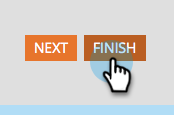

# Aprobación de un formulario {#approve-a-form}

Para agregar un formulario a una de las páginas de aterrizaje, debe aprobarse.

## Aprobación de un formulario {#approve}

A continuación se indica cómo aprobar un formulario existente que esté listo para utilizarse.

1. Vaya a **[!UICONTROL Actividades de marketing]**.

   

1. Seleccione el formulario que desee y haga clic en **[!UICONTROL Aprobar borrador]**.

   

   Aparecerá una marca de verificación verde.

   

   Está aprobado y listo para [agregarse a una página de aterrizaje](/help/marketo/product-docs/demand-generation/landing-pages/understanding-landing-pages/approve-unapprove-or-delete-a-landing-page.md){target="_blank"}.

   >[!NOTE]
   >
   >Los cambios realizados después de la aprobación pueden tardar unos minutos en actualizarse en los formularios incrustados.

## Aprobar un formulario desde el editor {#approve-from-the-editor}

Puede aprobar un formulario directamente desde el editor de formularios.

>[!PREREQUISITES]
>
>[Editar un formulario](/help/marketo/product-docs/demand-generation/forms/form-actions/edit-a-form.md)

1. En el formulario, haga clic en **[!UICONTROL Finalizar]**.

   

1. Haga clic en **[!UICONTROL Aprobar y cerrar]**.

   
