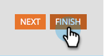

# Edición de una etiqueta de campo en un formulario {#edit-a-field-label-in-a-form}

Puede cambiar la etiqueta de un formulario a cualquier cosa, incluso puede utilizar una imagen o borrarla por completo. Así es como se hace.

1. Vaya a **[!UICONTROL Actividades de marketing]**.

   

1. Seleccione el formulario y haga clic en **[!UICONTROL Crear borrador]**.

   

   >[!NOTE]
   >
   >Si el formulario aún no se ha aprobado, haga clic en **Editar borrador**.

1. Seleccione su campo y luego edite la **[!UICONTROL Etiqueta]**. Los campos de Configuración de formulario reflejarán las etiquetas que haya introducido.

   

   >[!TIP]
   >
   >Haga clic en el icono  para acceder al editor de texto enriquecido.

1. Haga clic en **[!UICONTROL Finalizar]**.

   

1. Haga clic en **[!UICONTROL Aprobar y cerrar]**.

   

>[!NOTE]
>
>No olvide [aprobar los cambios del borrador de la página de aterrizaje](/help/marketo/product-docs/demand-generation/landing-pages/understanding-landing-pages/approve-unapprove-or-delete-a-landing-page.md){target="_blank"} creado por el formulario.
