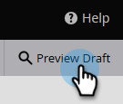

# Vista previa de un formulario {#preview-a-form}

Antes de publicar, puede ver el formulario en este visor de formularios rápido y sencillo.

1. Vaya a **[!UICONTROL Actividades de marketing]**.

   

1. Seleccione el formulario y haga clic en **[!UICONTROL Vista previa]**.

   

   >[!NOTE]
   >
   >Si el formulario no está aprobado, haga clic en **Vista previa del borrador**.

1. El editor de formularios se abrirá en el modo _vista previa_.

   

1. Haga clic en **[!UICONTROL Editar borrador]** para volver al modo _editar_.

   

1. Vuelva fácilmente haciendo clic en **[!UICONTROL Vista previa del borrador]**.

   
