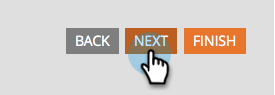

# Seleccionar un tema de formulario {#select-a-form-theme}

Hemos hecho un montón de temas agradables para sus formularios. ¿Cuál te gusta más?

1. Vaya a **[!UICONTROL Actividades de marketing]**.

   

1. Seleccione el formulario y haga clic en **[!UICONTROL Crear borrador]**.

   

   >[!NOTE]
   >
   >Si el formulario no está aprobado, haga clic en **Editar borrador**.

1. Vaya a **[!UICONTROL Configuración de formulario]**.

   

1. Alterne entre una y otra para elegir el **[!UICONTROL tema del formulario]** que le guste.

   

   Actualmente hay 7 temáticas integradas:

   * Simple
   * Recuadro
   * Brillo
   * Redondo
   * Oscuro
   * Sombreado
   * Sólido

   >[!TIP]
   >
   >También puede [editar el CSS del tema del formulario](/help/marketo/product-docs/demand-generation/forms/form-design/edit-the-css-of-a-form-theme.md){target="_blank"}.

1. Haga clic en **[!UICONTROL Siguiente]** para configurar otras opciones de formulario o haga clic en **[!UICONTROL Finalizar]** si solo desea cambiar el tema del formulario.

   

¿Fue fácil?! Ahora puedes dejar que tu libro de HTML/CSS recopile algo de polvo.

>[!MORELIKETHIS]
>
>* [Editar el CSS de un tema de formulario](/help/marketo/product-docs/demand-generation/forms/form-design/edit-the-css-of-a-form-theme.md){target="_blank"}
>* [Agregar un campo a un formulario](/help/marketo/product-docs/demand-generation/forms/creating-a-form/add-a-field-to-a-form.md){target="_blank"}
