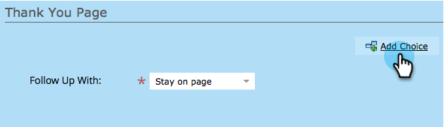
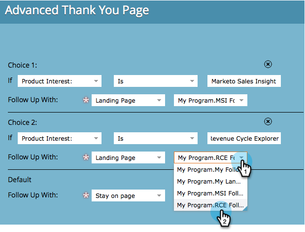

# Establecer una página de agradecimiento para un formulario {#set-a-form-thank-you-page}

¿Qué sucede cuando alguien rellena un formulario? ¿A dónde se reenvían? A continuación se muestra cómo configurarlo.

## Editar formulario {#edit-form}

1. Ir a **Actividades de marketing**.

   

1. Seleccione el formulario y haga clic en **Editar formulario**.

   

1. En **Configuración de formulario** click **Configuración**.

   

1. Desplácese hacia abajo hasta el **Página de agradecimiento** sección.

## Permanecer en la página {#stay-on-page}

La opción Permanecer en la página mantiene al visitante en la misma página cuando se envía el formulario.

1. Seleccionar **Permanecer en la página** para **Realice Un Seguimiento Con**.

   

## URL externa {#external-url}

La configuración URL externa permite definir cualquier dirección URL como página de seguimiento. Una vez que el usuario haya enviado el formulario, se le dirigirá a la dirección URL especificada.

1. Seleccionar **URL externa** para **Realice Un Seguimiento Con**.

   

1. Introduzca la dirección URL completa.

   

>[!TIP]
>
>La URL puede ser la de un archivo alojado en alguna parte: si lo hace, el botón &quot;Enviar&quot; se comportará como un botón &quot;Descargar&quot;.

## Página de aterrizaje {#landing-page}

Puede seleccionar cualquier página de aterrizaje de Marketo aprobada como seguimiento.

1. Establecer **Realice Un Seguimiento Con** hasta **Página de aterrizaje**.

   

1. Busque y seleccione la página de aterrizaje que desee.

   

## Páginas de agradecimiento dinámicas {#dynamic-thank-you-pages}

Puede agregar varias opciones y crear opciones para mostrar a las personas diferentes seguimientos según sus respuestas.

1. Clic **Agregar opción**.

   

1. Seleccione el campo del que desea supervisar la respuesta.

   

   >[!TIP]
   >
   >Solo los campos agregados al formulario están disponibles para esto.

1. Seleccione el operador lógico que desee.

   

1. Introduzca uno de los valores con los que el usuario responderá.

   

1. Elija la página adecuada para **Realice Un Seguimiento Con** escriba.

   

1. Seleccione la página de aterrizaje adecuada.

   

   >[!NOTE]
   >
   >Debe haber creado o aprobado estas páginas de aterrizaje con antelación.

1. Haga clic en **+** firme para agregar otra opción.

   

   >[!NOTE]
   >
   >Puede agregar varias opciones. Sin embargo, si agrega demasiados, puede afectar a la velocidad de carga del formulario, por lo que solo tiene que agregar lo que necesite.

1. Vaya y configúrelo **Opción 2**.

   

   >[!TIP]
   >
   >No dude en mezclar y hacer coincidir los tipos de seguimiento. Puede utilizar una página de aterrizaje para una opción y una dirección URL para otra.

1. Establezca una Página predeterminada para todas las demás respuestas.

   

1. Seleccione la propia página y haga clic en **Guardar**.

   

   ¡Bien, se ve bien!

   

1. Clic **Finalizar**.

   

1. Clic **Aprobar y cerrar**.

   

¡bueno trabajo!
