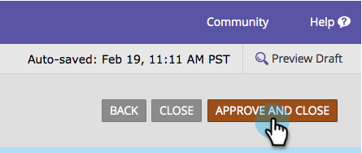

# Agregar una lista de selección de países al formulario {#add-a-country-picklist-to-your-form}

Siga estas instrucciones para convertir el campo de país a un menú desplegable con una lista de todos los países.

1. Vaya a **Actividades de marketing**.

   

1. Seleccione el formulario y haga clic en **Editar formulario**.

   

1. Haga clic en el **+** en la ficha

   

1. Buscar y seleccionar **País**.

   

1. Con la variable **País** campo seleccionado cambiar el **Tipo de campo** a **Select**.

   

1. **Editar** el **Valores** para añadir la lista de países entre los que los usuarios pueden elegir.

   

1. Haga clic en **Avanzadas** **Editor**.

   

1. Seleccione y copie esta lista de países:

   ```
   Afghanistan Albania Algeria Andorra Angola Antigua & Deps Argentina Armenia Australia Austria Azerbaijan Bahamas Bahrain Bangladesh Barbados Belarus Belgium Belize Benin Bhutan Bolivia Bosnia Herzegovina Botswana Brazil Brunei Bulgaria Burkina Burundi Cambodia Cameroon Canada Cape Verde Central African Rep Chad Chile China Colombia Comoros Congo Congo (Democratic Rep) Costa Rica Croatia Cuba Cyprus Czech Republic Denmark Djibouti Dominica Dominican Republic East Timor Ecuador Egypt El Salvador Equatorial Guinea Eritrea Estonia Ethiopia Fiji Finland France Gabon Gambia Georgia Germany Ghana Greece Grenada Guatemala Guinea Guinea-Bissau Guyana Haiti Honduras Hungary Iceland India Indonesia Iran Iraq Ireland (Republic) Israel Italy Ivory Coast Jamaica Japan Jordan Kazakhstan Kenya Kiribati Korea North Korea South Kosovo Kuwait Kyrgyzstan Laos Latvia Lebanon Lesotho Liberia Libya Liechtenstein Lithuania Luxembourg Macedonia Madagascar Malawi Malaysia Maldives Mali Malta Marshall Islands Mauritania Mauritius Mexico Micronesia Moldova Monaco Mongolia Montenegro Morocco Mozambique Myanmar (Burma) Namibia Nauru Nepal Netherlands New Zealand Nicaragua Niger Nigeria Norway Oman Pakistan Palau Panama Papua New Guinea Paraguay Peru Philippines Poland Portugal Qatar Romania Russian Federation Rwanda St Kitts & Nevis St Lucia Saint Vincent & the Grenadines Samoa San Marino Sao Tome & Principe Saudi Arabia Senegal Serbia Seychelles Sierra Leone Singapore Slovakia Slovenia Solomon Islands Somalia South Africa South Sudan Spain Sri Lanka Sudan Suriname Swaziland Sweden Switzerland Syria Taiwan Tajikistan Tanzania Thailand Togo Tonga Trinidad & Tobago Tunisia Turkey Turkmenistan Tuvalu Uganda Ukraine United Arab Emirates United Kingdom United States Uruguay Uzbekistan Vanuatu Vatican City Venezuela Vietnam Yemen Zambia Zimbabwe
   ```

1. Pegue la lista en el editor.

   

   >[!TIP]
   >
   >Puede editar la lista o utilizar cualquier otra lista.

1. Haga clic en **Guardar**.

   

1. Haga clic en **Finalizar**.

   

1. Haga clic en **Aprobar y cerrar**.

   

   ¡Bien hecho! Ahora, cuando una persona rellena el formulario, puede elegir entre la lista de países proporcionada.

   

Como eso fue tan fácil, ¿por qué no hacer más? ¿Qué sucede si se muestra dinámicamente el campo Estado cuando un usuario selecciona Estados Unidos como país de la lista? Consulte el artículo relacionado a continuación para saber cómo hacerlo.

>[!MORELIKETHIS]
>
>[Alternar dinámicamente la visibilidad de un campo de formulario](/help/marketo/product-docs/demand-generation/forms/form-fields/dynamically-toggle-visibility-of-a-form-field.md)
