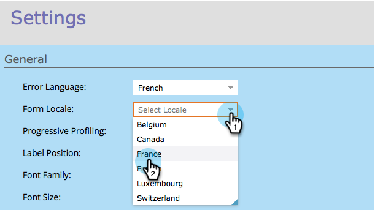

# Cambiar la configuración regional de un formulario {#change-a-forms-locale}

Al tratar con formularios internacionales, querrá mostrar las fechas y horas en los formatos correctos. Marketo lo hará automáticamente, todo lo que tiene que hacer es establecer la configuración regional del formulario y nosotros nos encargamos del resto.

1. Vaya a **[!UICONTROL Actividades de marketing]**.

   

1. Seleccione el formulario y haga clic en **[!UICONTROL Editar formulario]**.

   

1. En **[!UICONTROL Configuración de formulario]**, haga clic en **[!UICONTROL Configuración]**.

   

1. Seleccione la **[!UICONTROL configuración regional del formulario]** que elija.

   

1. Haga clic en **[!UICONTROL Finalizar]**.

   

1. Haga clic en **[!UICONTROL Aprobar y cerrar]** para aplicar y guardar los cambios.

   >[!NOTE]
   >
   >El formulario debe aprobarse para poder utilizarse en páginas de aterrizaje.

   

   >[!NOTE]
   >
   >Recuerde [aprobar los cambios del borrador de la página de aterrizaje](/help/marketo/product-docs/demand-generation/landing-pages/understanding-landing-pages/approve-unapprove-or-delete-a-landing-page.md) creado por el formulario.

   ¡Eso es todo! Las personas pueden ver la fecha y la hora en la configuración regional correcta.

   
