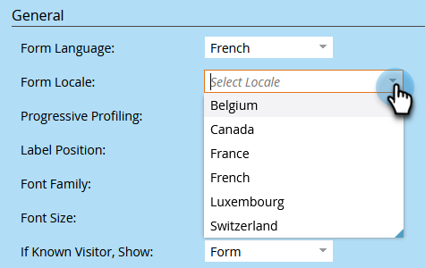

# Cambiar el idioma de un formulario {#change-the-language-of-a-form}

Aprenda a cambiar el idioma del formulario.

1. Vaya a **Actividades de marketing**.

   

1. Seleccione el formulario y haga clic en **Editar formulario**.

   

1. Haga clic en **Configuración de formulario** y seleccione **Configuración**.

   

1. Seleccione el **Idioma del formulario**.

   

   PASO OPCIONAL: Elija la configuración regional o la región del idioma seleccionado.

   

1. Haga clic en **Finalizar**.

   

1. Haga clic en **Aprobar y cerrar** para aplicar y guardar cambios.

   

   >[!NOTE]
   >
   >El formulario debe aprobarse para utilizarse en páginas de aterrizaje.

   >[!TIP]
   >
   >Recuerde [aprobar la página de aterrizaje](/help/marketo/product-docs/demand-generation/landing-pages/understanding-landing-pages/approve-unapprove-or-delete-a-landing-page.md) borrador creado por el formulario cambia.

El formulario ahora reflejará el idioma seleccionado.

