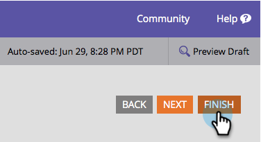

# Cambiar el idioma de los mensajes de error/validación del formulario y el botón de envío {#change-the-language-of-form-validation-error-messages-and-submit-button}

¿Sabía que puede personalizar el formulario para enviar mensajes en otro idioma? Mira esto.

>[!NOTE]
>
>Esto también cambia el idioma del botón de envío.

1. Vaya a **Actividades de marketing**.

   

1. Seleccione el formulario y haga clic en **Editar formulario**.

   

1. En **Configuración de formulario**, haga clic en **Configuración**.

   

1. Seleccione el **Idioma del error** necesitas.

   

1. Haga clic en **Finalizar**.

   

1. Haga clic en **Aprobar y cerrar** para aplicar y guardar cambios.

   >[!NOTE]
   >
   >El formulario debe aprobarse para utilizarse en páginas de aterrizaje.

   

   >[!NOTE]
   >
   >Recuerde [aprobar la página de aterrizaje](/help/marketo/product-docs/demand-generation/landing-pages/understanding-landing-pages/approve-unapprove-or-delete-a-landing-page.md) borrador creado por el formulario cambia.

   

¡Y voila! Los mensajes de error y validación del formulario se mostrarán ahora en su idioma preferido.
