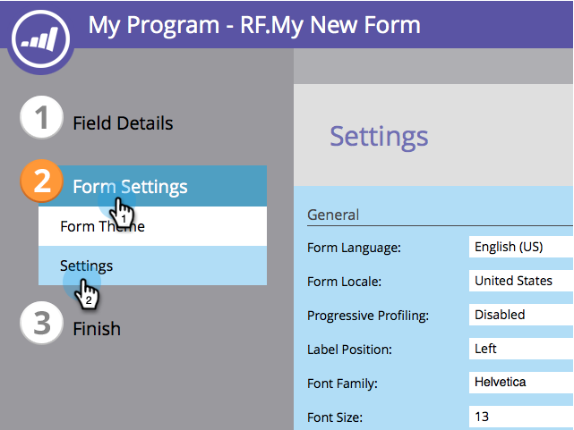
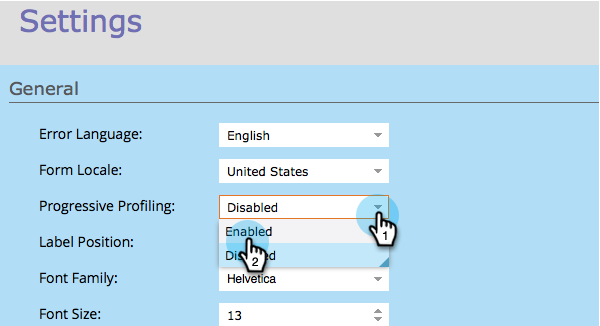
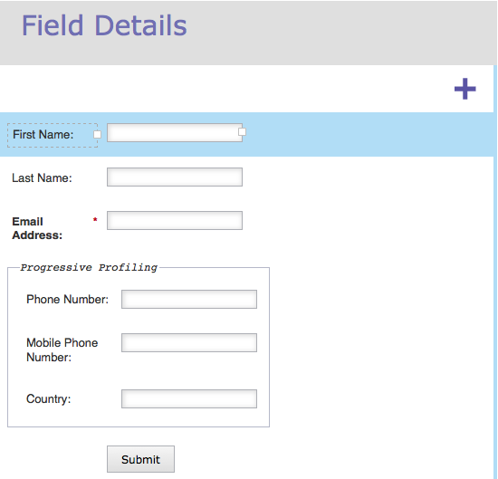

# Configurar perfil progresivo de formulario {#configure-form-progressive-profiling}

¡Las formas cortas son buenas! Cuando alguien vuelve a un formulario, puede presentar nuevos campos y rellenar progresivamente el perfil del visitante. Así es como.

>[!NOTE]
>
>Para que esta función funcione correctamente, asegúrese de que Rellenar previamente formulario esté habilitado para los campos visibles y [deshabilitado](/help/marketo/product-docs/demand-generation/forms/form-fields/disable-pre-fill-for-a-form-field.md) para los campos ocultos.

1. Vaya a **Actividades de marketing**.

   

1. Seleccione el formulario y haga clic en **Editar formulario**.

   

1. En **Configuración de formulario**, haga clic en **Configuración**.

   

1. Establezca **Perfil progresivo** en **Habilitado**.

   

1. Bien, ahora vamos a configurarlo. Vaya a **Detalles del campo**.

   

1. Arrastre y suelte todos los campos que forman parte del conjunto de perfiles progresivos.

   

1. Cuando termine de mover todos los campos, debería tener un aspecto similar al siguiente:

   

   >[!NOTE]
   >
   >Los campos que están fuera del cuadro **Perfiles progresivos** siempre se mostrarán en el formulario, aunque estén rellenados.

1. Seleccione la casilla **Perfiles progresivos**.

   

   >[!CAUTION]
   >
   >Tenga cuidado al utilizar los campos obligatorios en la generación progresiva de perfiles. Estos campos podrían permanecer en blanco si el visitante introduce una nueva dirección de correo electrónico (que crearía una nueva persona) después de enviar anteriormente los datos de los demás campos, ya que se suprimirían en el formulario más reciente.

1. Ahora elija cuántos campos en blanco desea que vean los usuarios en el cuadro **Perfiles progresivos** en un momento dado.

   

   >[!NOTE]
   >
   >Si elige **Número** **de** **Campos** **en blanco** como 1, el visitante verá lo siguiente la primera vez que vea este formulario:
   >
   >* Nombre (vacío)
   >* Apellidos (vacío)
   >* Dirección de correo electrónico (vacía)
   >* Número de teléfono (vacío)
   >
   >Si rellenan todos los campos, la segunda vez que visiten, verán lo siguiente:
   >
   >* Nombre (rellenado previamente)
   >* Apellido (rellenado previamente)
   >* Dirección de correo electrónico (rellenada previamente)
   >* Número de teléfono móvil (vacío)
   >
   >Si rellenan el número de teléfono móvil, la tercera vez que lo visiten verán lo siguiente:
   >
   >* Nombre (rellenado previamente)
   >* Apellido (rellenado previamente)
   >* Dirección de correo electrónico (rellenada previamente)
   >* País (vacío)

1. Haga clic en **Finalizar**.

   

1. Haga clic en **Aprobar y cerrar**.

   

¡Buen trabajo! El trabajo que acabas de hacer dará sus frutos.

Experimente con esta función y asegúrese de realizar pruebas. Es avanzado, pero puede hacer que sus formularios sean muy dinámicos de esta manera.
