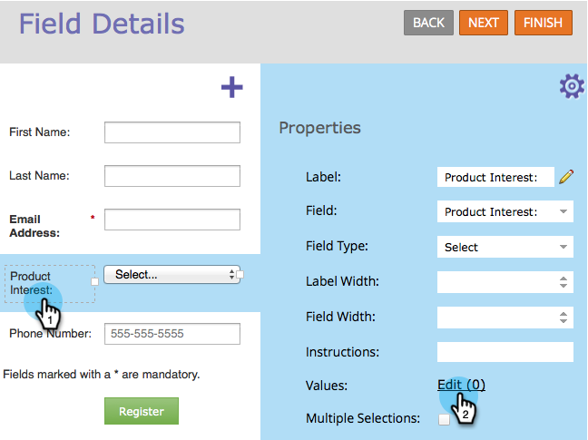

# Definir valores en una radio o campo seleccionado en un formulario {#define-values-in-a-radio-or-selected-field-in-a-form}

Una vez que haya [establecido un tipo de campo](/help/marketo/product-docs/administration/field-management/change-the-type-of-a-marketo-custom-field.md) para que sea un botón de opción o un tipo de selección, querrá definir los valores entre los que el usuario puede elegir. Así es cómo se hace.

1. Vaya a **[!UICONTROL Actividades de marketing]**.

   

1. Seleccione el formulario y haga clic en **[!UICONTROL Editar formulario]**.

   

1. Seleccione el campo y haga clic en **[!UICONTROL Editar]**.

   

   >[!NOTE]
   >
   >El primer valor predeterminado siempre es &quot;[!UICONTROL Select...]&quot; Siéntase libre de editar eso. Si cambia el botón de opción predeterminado a otra fila, &quot;[!UICONTROL Seleccionar...]&quot; no aparecerá como una opción en el formulario.

1. Haga clic en para añadir su valor.

   

   >[!NOTE]
   >
   >**Definición**
   >
   >**[!UICONTROL Valor para mostrar]:** Lo que se muestra al visitante.
   >
   >**[!UICONTROL Valor almacenado]:** Lo que se ha registrado en Marketo.

1. Agregue todos los valores que necesite y haga clic en **[!UICONTROL Guardar]**.

   >[!NOTE]
   >
   >Si no ingresas un [!UICONTROL Valor almacenado], Marketo usará el [!UICONTROL Valor mostrado] y lo almacenará.

   

   >[!TIP]
   >
   >Haga clic en **[!UICONTROL Editor avanzado]** para copiar y pegar una lista de valores si lo desea. Puede ahorrar tiempo en realidad.

1. Haga clic en **[!UICONTROL Finalizar]**.

   

1. Haga clic en **[!UICONTROL Aprobar y cerrar]**.

   
