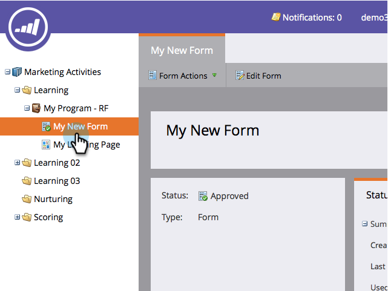

# Eliminar un formulario {#delete-a-form}

Si tiene un formulario que no necesita y no se está utilizando, puede eliminarlo. Así es como.

1. Vaya a **Actividades de marketing**.

   

1. Busque y seleccione el formulario.

   

1. En **Acciones de formulario**, haga clic en **Eliminar formulario**.

   

   >[!NOTE]
   >
   >Recuerde quitar el formulario de todas las páginas de aterrizaje que lo utilicen. Además, confirme que el formulario no se está utilizando en un sitio web público.

1. Confirme haciendo clic en **Eliminar**.

   

1. Si el formulario se está utilizando en una página de aterrizaje de Marketo, no se le permitirá eliminarlo. Debe ir y eliminarlo de las páginas de aterrizaje en las que esté.

   

>[!CAUTION]
>
>Si elimina un formulario que esté utilizando en su sitio web público, no verá una advertencia y el formulario se romperá. Tenga en cuenta  [archivarlo](/help/marketo/product-docs/email-marketing/drip-nurturing/using-stream-content/archive-and-unarchive-stream-content.md) en su lugar.
