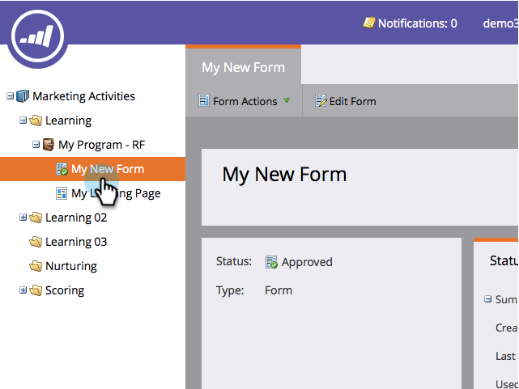
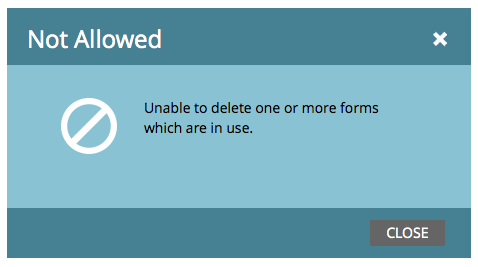

# Eliminar un formulario {#delete-a-form}

Si tiene un formulario que no necesita y no se está utilizando, puede eliminarlo. Así es cómo se hace.

1. Vaya a **[!UICONTROL Actividades de marketing]**.

   

1. Busque y seleccione su formulario.

   

1. En **[!UICONTROL Acciones de formulario]**, haga clic en **[!UICONTROL Eliminar formulario]**.

   

   >[!NOTE]
   >
   >Recuerde quitar el formulario de todas las páginas de aterrizaje que lo utilicen. Además, confirme que el formulario no se está utilizando en un sitio web público.

1. Confirme haciendo clic en **[!UICONTROL Eliminar]**.

   

1. Si el formulario se está utilizando en una página de aterrizaje de Marketo, no se le permitirá eliminarlo. Tienes que ir y eliminarlo de cualquier página de aterrizaje en la que vive.

   

>[!CAUTION]
>
>Si elimina un formulario que se está utilizando en un sitio web público, no verá una advertencia y el formulario se romperá. Considere [archivarlo](/help/marketo/product-docs/email-marketing/drip-nurturing/using-stream-content/archive-and-unarchive-stream-content.md) en su lugar.
