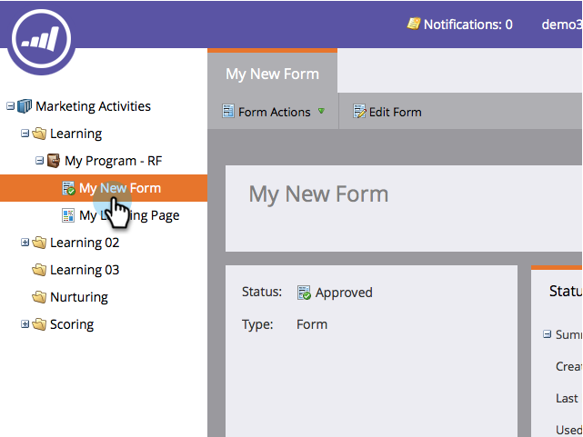

# Incrustar un formulario en el sitio web {#embed-a-form-on-your-website}

Marketo le permite incrustar los formularios en su propio sitio web. A continuación, se indica cómo obtener acceso al código incrustado.

1. Vaya a **[!UICONTROL Actividades de marketing]**.

   

1. Busque y seleccione su formulario.

   

1. En **[!UICONTROL Acciones de formulario]**, haga clic en **[!UICONTROL Código incrustado]**.

   >[!NOTE]
   >
   >El formulario debe aprobarse para que el elemento **[!UICONTROL Código incrustado]** sea visible/utilizable.

   

   >[!CAUTION]
   >
   >**[El relleno previo de formulario](/help/marketo/product-docs/administration/settings/edit-landing-page-settings.md)** no funciona al usar el código incrustado de formulario en sus propias páginas _o_ en una página de aterrizaje de Marketo. El prerrellenado del formulario solo está diseñado para funcionar cuando el formulario se utiliza en una página de aterrizaje de Marketo a través de la opción Insertar elemento.

1. Seleccione o copie el código de incrustación y luego haga clic en **[!UICONTROL Cerrar]**.

   

>[!TIP]
>
>Una vez que el código esté incrustado en el sitio web, cualquier cambio en el formulario en Marketo se insertará en el sitio tras la aprobación del formulario. No es necesario que realice más cambios en el código.

Ahora solo tiene que proporcionar el código incrustado al desarrollador web y hacer que lo añada al sitio.

>[!NOTE]
>
>Si el desarrollador desea personalizar el aspecto o acceder a las funciones avanzadas de la API, muéstreles la [página para desarrolladores de Forms 2.0](https://experienceleague.adobe.com/en/docs/marketo-developer/marketo/javascriptapi/forms-api-reference).

Para el código Lightbox, consulte [Usar un formulario en un Lightbox](/help/marketo/product-docs/demand-generation/forms/form-actions/use-a-form-in-a-lightbox.md).
