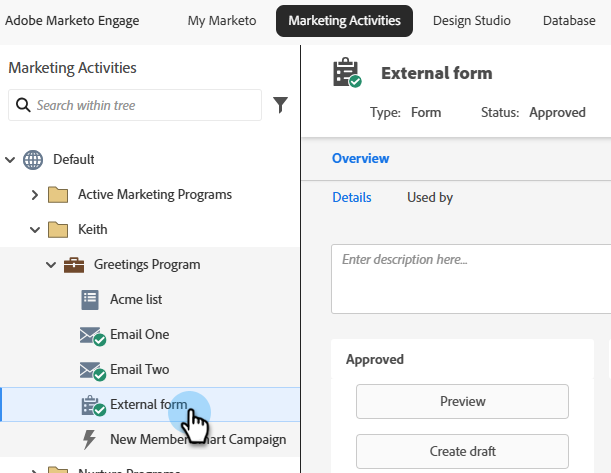
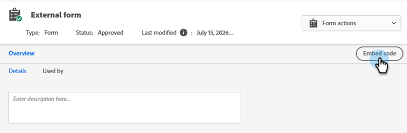
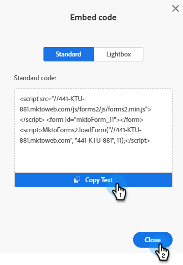

# Incrustar un formulario en el sitio web {#embed-a-form-on-your-website}

Acceda al código incrustado de un formulario para alojarlo en su propio sitio web.

>[!PREREQUISITES]
>
>El formulario debe aprobarse para que el código incrustado esté disponible.

1. Busque y seleccione el formulario que desee.

   

1. A la derecha de la pantalla de detalles del formulario, haga clic en **[!UICONTROL Código incrustado]**.

   

   >[!CAUTION]
   >
   >**[El relleno previo de formulario](/help/marketo/product-docs/administration/settings/edit-landing-page-settings.md)** no funciona al usar el código incrustado de formulario en sus propias páginas _o_ en una página de aterrizaje de Marketo. El prerrellenado del formulario solo está diseñado para funcionar cuando el formulario se utiliza en una página de aterrizaje de Marketo a través de la opción Insertar elemento.

1. En la ficha _Estándar_, haga clic en **[!UICONTROL Copiar texto]**. Haga clic en **[!UICONTROL Cerrar]** cuando haya terminado.

   

   >[!NOTE]
   >
   >Para el código Lightbox, consulte [Usar un formulario en un Lightbox](/help/marketo/product-docs/demand-generation/forms/form-actions/use-a-form-in-a-lightbox.md).

1. Proporcione el código incrustado al desarrollador web.

   Una vez que el código esté incrustado en el sitio web, cualquier cambio en el formulario en Marketo Engage se insertará en el sitio tras la aprobación del formulario. No es necesario realizar cambios en el código.

   >[!TIP]
   >
   >Si el desarrollador desea personalizar el aspecto o acceder a las funciones avanzadas de la API, muéstreles la [página para desarrolladores de Forms 2.0](https://experienceleague.adobe.com/en/docs/marketo-developer/marketo/javascriptapi/forms-api-reference).
