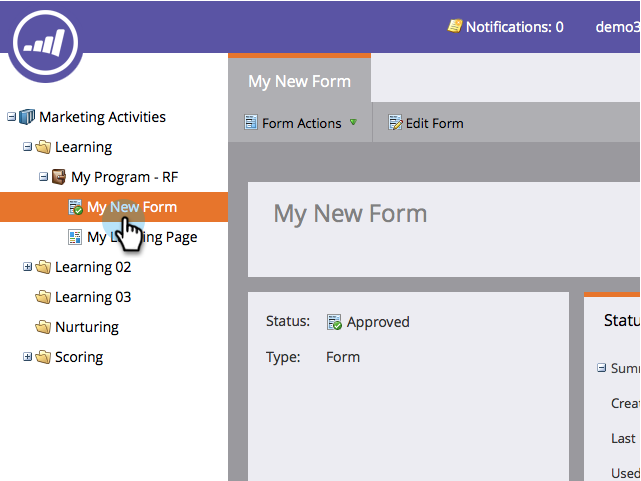

# Utilizar un formulario en un Lightbox {#use-a-form-in-a-lightbox}

Un Lightbox es una técnica que abre un formulario delante del contenido cuando se desea que se muestre. Así es como.

1. Vaya a **Marketing** **Actividades**.

   

1. Busque y seleccione el formulario.

   

1. En **Formulario** **Acciones**, haga clic en **Incrustar** **Código**.

   >[!NOTE]
   >
   >**Recordatorio**
   >
   >
   >El formulario debe aprobarse para que el elemento de código incrustado sea visible o utilizable.

   

1. Establezca **Código** **Tipo** en **Lightbox**.

   

1. Seleccione o copie el código y haga clic en **Cerrar**.

   

Envíe el código a su desarrollador web y pídale que lo añada a su sitio web.

¡bueno trabajo!
