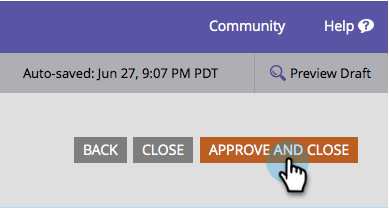

# Cambiar posición de etiqueta del formulario {#change-form-label-position}

Al [crear un formulario](/help/marketo/product-docs/demand-generation/forms/creating-a-form/create-a-form.md), puede cambiar la posición de las etiquetas del campo de formulario muy fácilmente. Así es cómo se hace.

1. Vaya a **[!UICONTROL Actividades de marketing]**.

   

1. Seleccione el formulario y haga clic en **[!UICONTROL Editar formulario]**.

   

1. Seleccione **[!UICONTROL Configuración]**.

   

1. Seleccione la **[!UICONTROL Posición de etiqueta]** que desee.

   

   Actualmente tiene dos opciones:

   * [!UICONTROL Izquierda] (predeterminado)
   * [!UICONTROL Superior]

1. Haga clic en **[!UICONTROL Finalizar]**.

   

1. Haga clic en **[!UICONTROL Aprobar y cerrar]**.

   >[!NOTE]
   >
   >El formulario debe aprobarse para poder utilizarse en páginas de aterrizaje.

   

   >[!NOTE]
   >
   >Recuerde aprobar los cambios del borrador de la página de aterrizaje creado por el formulario.

¡Bien hecho! ¿Ve lo fácil que era cambiar las posiciones de las etiquetas en un formulario? Bien, veamos qué podemos hacer para cambiar la fuente de las etiquetas del formulario.

>[!MORELIKETHIS]
>
>[Cambiar la familia de fuentes del formulario](/help/marketo/product-docs/demand-generation/forms/form-design/change-the-form-font-family.md)
