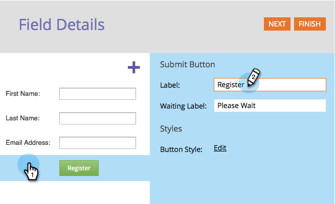

# Cambiar el texto del botón de envío de formulario {#change-form-submit-button-text}

Puede cambiar rápida y fácilmente un botón de formulario de &quot;Enviar&quot; a cualquier otra palabra. Así es como.

1. Vaya a **Actividades de marketing**.

   

1. Seleccione el formulario y haga clic en **Editar formulario**.

   

1. Seleccione el botón y cambie el **Etiqueta**.

   

   >[!TIP]
   >
   >Tenga en cuenta que también puede cambiar la etiqueta Esperando . Esto se muestra después de hacer clic en el botón y antes de que finalice la acción de envío del formulario.

1. Haga clic en **Finalizar**.

   

1. Haga clic en **Aprobar y cerrar**.

   

   ¡Bam!

   
